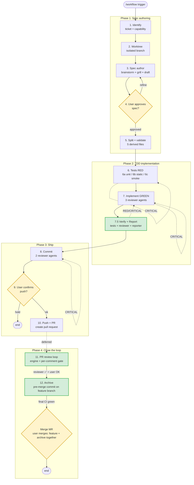
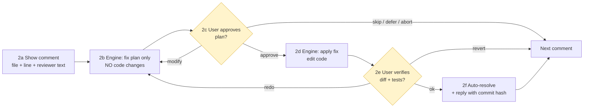

# Spec-Driven Development Pipeline

A 12-stage pipeline that takes a feature from intent to archived spec, with mandatory verification gates and parallel reviewer agents at each step.

Designed for AI-assisted, spec-first workflows. Tool-agnostic where possible — see [Customization](#customization) for substitution points.

---

## Table of Contents

- [Core Principles](#core-principles)
- [Pipeline Overview](#pipeline-overview)
- [Stage Table](#stage-table)
- [Stage Details](#stage-details)
- [Stage 7.5 vs Stage 11](#stage-75-vs-stage-11)
- [Reviewer Dispatch Pattern](#reviewer-dispatch-pattern)
- [Convergence Boundary](#convergence-boundary)
- [Fast Mode](#fast-mode)
- [Skip Rule](#skip-rule)
- [Resume Entries](#resume-entries)
- [Customization](#customization)
- [File Layout](#file-layout)
- [Common Mistakes](#common-mistakes)

---

## Core Principles

1. **Every change traces to a spec.** No code without a `spec.md`.
2. **Single source of truth.** Authors edit one file; derived artifacts are projections.
3. **Verification before commit.** No commit until tests are green and there are zero CRITICAL spec violations — except findings the user has already adjudicated at a cap-hit gate (disposition `rejected` / `deferred (ticket)`), which no longer count against this gate.
4. **Lifecycle ends at archive, not at push.** PR review and pre-merge archive (commit added on the feature branch after reviewer ✅, before final merge) are part of the pipeline.
5. **Per-comment user gate in review fixes.** The fix engine never batches multiple PR comments without human approval per item.
6. **Reviewer agents in parallel, never serial.** Multiple reviewer personas at each stage are dispatched in a single message.
7. **CRITICAL blocks; WARNING/SUGGESTION surfaces.** Two carve-outs from the convergence boundary: user-adjudicated findings (`rejected`/`deferred`) stop blocking, and net-new CRITICAL-class findings logged `pending` during a re-dispatch round don't block the loop — but MUST be listed at the Stage 9 gate (they never ship silently).
8. **Convergence boundary.** Cleanliness and correctness are enforced in layers — deterministic tooling first, spec-derived tests second, AI review last; what a tool can verify, a reviewer must not raise. CRITICAL is reserved for code/test/behavior correctness and security-baseline violations, every finding carries a fix-cost estimate, and review-fix loops are capped. See [Convergence Boundary](#convergence-boundary).

---

## Pipeline Overview



Legend: yellow = user gate, green = stage added in this revision.

---

## Stage Table

| #    | Stage              | Trigger              | Action                                                            | Reviewers   | Output                          | User gate           |
| ---- | ------------------ | -------------------- | ----------------------------------------------------------------- | ----------- | ------------------------------- | ------------------- |
| 1    | Identify           | `/workflow`          | ticket + capability decision + `{name}`                           | —           | name, ticket, MODIFIED/ADDED    | —                   |
| 2    | Worktree           | auto                 | new spec → mandatory `.worktrees/{name}`                          | —           | correct branch                  | —                   |
| 3    | Spec author        | auto                 | inline brainstorm + grill + draft `spec.md`                       | —           | `spec.md` (source of truth)     | —                   |
| 4    | Approve spec       | user                 | review `spec.md`                                                  | —           | approve / refine                | yes                 |
| 5    | Split + validate   | auto                 | derive 5 files; run validator                                     | —           | 6 files                         | —                   |
| 6    | Tests (RED)        | auto                 | unit / static / smoke per mode                                    | 3 / 2 / 0   | failing tests / script / list   | —                   |
| 7    | Implement (GREEN)  | auto                 | production code → tests GREEN                                     | 3           | reviewed code                   | —                   |
| 7.5  | Verify + Report    | auto                 | test gate + spec-vs-code review + coverage report                 | —           | `report.md` + 0 CRITICAL        | —                   |
| 8    | Commit             | auto                 | conventional commit + spec footer                                 | 2           | local commit                    | —                   |
| 9    | Confirm push       | user                 | view diff stats + branch + remote                                 | —           | push / hold                     | yes                 |
| 10   | Push + PR          | auto                 | `git push` + create pull request                                  | —           | remote branch + PR              | —                   |
| 11   | PR review loop     | deferred             | fix engine + per-comment gate + auto-resolve                      | —           | resolved discussions, ready-to-merge | yes (2 per comment) |
| 12   | Archive            | reviewer ✅ + user OK | `openspec archive` commit on feature branch → push → CI green → **user merges MR**; local cleanup user-side | —      | spec archived, env clean        | yes (OK-to-merge + final merge) |

---

## Stage Details

### Stage 1 — Identify

Establish ticket + capability scope.

- Prompt user for **ticket ID** (issue tracker). Optional for personal/exploratory work.
- Prompt user for **one-line feature description**.
- Derive `{name}` (kebab-case).
- List existing capabilities (archived in spec tree + in-progress in other changes).
- Decide: attach to existing capability (**MODIFIED**) or create a new one (**ADDED**).
- If `openspec/changes/{name}/` already exists → ask user which stage to resume from.

### Stage 2 — Worktree

Create isolated workspace.

```bash
git worktree add .worktrees/{name} -b feat/{branch_name} <base_branch>
cd .worktrees/{name}
```

Rule: new specs MUST NOT work in the main repo. Resume of existing change → reuse existing worktree or current branch.

### Stage 3 — Spec author

Inline brainstorm + optional grill round, then draft `spec.md`.

**Scope audit** (mandatory before the spec claims any file / entry-point / call-site count): the number must come from a full-codebase grep, never from a subagent's sampled search. Grep call sites, not imports — match the call token itself (e.g. `grep -rnE '\bFoo\('` scoped to the stack's source extensions); import matching misses wildcard imports and fully-qualified calls.

Sections:

- `# {Feature Name}`
- `## Why`, `## What`, `## Impact`
- `## Design` (optional)
- `## Requirements` (Requirement → nested Scenarios)
- `## Tasks`

`spec.md` is the **single source of truth**. The 5 derived files in Stage 5 are projections — users edit only `spec.md`.

### Stage 4 — Approve spec (user gate)

User reads `spec.md`. Approve or refine (loop back to Stage 3).

### Stage 5 — Split + validate

Project `spec.md` into 5 derived files in the same folder:

```
openspec/changes/{name}/
├── spec.md                ← single source of truth (KEEP)
├── .openspec.yaml         ← metadata (derived)
├── proposal.md            ← Why + What + Impact (derived)
├── design.md              ← Design (derived)
├── specs/{name}/spec.md   ← Requirements with ADDED/MODIFIED prefix (derived)
└── tasks.md               ← Tasks (derived)
```

Run the spec validator. Fix errors by editing `spec.md` and re-splitting. **Never edit derived files by hand.**

### Stage 6 — Tests (RED)

Classify spec type by Scenario fingerprints:

| Mode                       | Fingerprints                                              | Output                | Reviewers                                |
| -------------------------- | --------------------------------------------------------- | --------------------- | ---------------------------------------- |
| **6a Unit-test**           | runtime entities (state holders, controllers, data sources), `WHEN <user action>`, `WHEN <external system returns>` | failing unit tests    | 3 (coverage, isolation, quality)         |
| **6b Static-validation**   | `WHEN inspect <file>`, `THEN NOT contains <pattern>`      | assertion script      | 2 (coverage, correctness)                |
| **6c Manual-smoke**        | on-device install + verify, post-build artifact inspection, smoke matrix | `smoke-checklist.md`  | 0 (no automated review possible)         |

Confirm tests/script fail with current code (true RED). For Mode 6c there is nothing to automate yet — proceed.

A spec may be **mixed**: fall through modes for the matching subset of Scenarios.

### Stage 7 — Implement (GREEN)

Implement production code until tests are GREEN.

Dispatch **3 parallel reviewer agents** (single message, 3 tool calls):

- `review-spec-compliance` — every `SHALL` / Scenario satisfied
- `review-code-quality` — project conventions, layering rules, error-handling and safety invariants (specifics defined by the project's `code-reviewer` skill; lint-detectable items belong to the Stage 7.5 lint gate, not this reviewer)
- `review-edge-cases` — error paths, boundaries, concurrent access, off-by-one

CRITICAL → fix → re-dispatch same reviewers.

### Stage 7.5 — Verify + Report

Mandatory gate before any commit.

1. **Lint gate**: run `{LINT_COMMAND}` (lint / format / static analysis). RED → fix and re-run, **at most 2 fix attempts** — some rules (e.g. complexity thresholds) have no mechanical fix, so still-red after 2 attempts goes to a user gate instead of looping or drive-by refactoring. No reviewer agent is dispatched until lint is green. Once green, issues **this project's `{LINT_COMMAND}` toolchain actually checks** are off-limits for every reviewer. Projects without a linter bind a no-op — then nothing is tool-verified, so reviewers may still raise style findings, capped at SUGGESTION.
2. **Test gate**: run full test suite (scoped to changed modules if monorepo). RED → loop back to Stage 7.
3. **Verify**: invoke `code-reviewer` agent — compares spec line-by-line against implementation. Must return **0 CRITICAL** (user-adjudicated `rejected`/`deferred` findings don't count). Any CRITICAL → loop back to Stage 7.
4. **Report**: invoke `reporter` agent → write `openspec/changes/{name}/report.md` containing:
   - Requirement × Scenario coverage matrix
   - Spec vs implementation diff
   - Outstanding issue list
5. Surface report summary inline so user sees coverage before commit.

**7.5 loop-back counter**: steps 2 and 3 share one counter — **max 2 loop-backs to Stage 7 total** (test-RED and verify-CRITICAL both consume it). A loop-back re-enters Stage 7 fix-only: no fresh reviewer rounds, Stage 7's own re-dispatch budget does not reset. Counter exhausted with red tests or live CRITICALs → the cap-hit user gate ([Convergence Boundary](#convergence-boundary)).

For Mode 6c (manual-smoke) specs: skip the test gate (no automated tests); still run verify + report against the smoke checklist; user must complete the smoke matrix manually before Stage 9.

### Stage 8 — Commit

Compose conventional commit with spec footer:

```
{type}({scope}): {description} [TICKET-XXX]

{optional body}

Spec: openspec/changes/{name}/specs/{name}/spec.md
Scenarios: scenario-1, scenario-2
AI-assisted: yes
```

Dispatch **2 parallel reviewer agents**:

- `review-commit-message` — type/scope correct, footer complete, ticket reference present
- `review-changeset` — diff matches description, no scope creep, no stray files

CRITICAL → fix → re-dispatch. Then `git commit`.

### Stage 9 — Confirm push (user gate)

Show: commit hash, subject, diff stats, branch name, target remote — plus any net-new CRITICAL-class findings logged `pending` during re-dispatch rounds (sorted by cost ascending), so nothing known ships unseen. User: push or hold.

### Stage 10 — Push + PR

```bash
git push origin "feat/{branch_name}"
# GitHub:
gh pr create --base <integration_branch> --title "..." --body "..."
# GitLab:
glab mr create --target-branch <integration_branch> --title "..." --description "..."
```

PR description includes spec path + ticket link.

### Stage 11 — PR review loop

Deferred trigger. After push, reviewers may take hours or days. User re-enters via:

```
/workflow --mr-loop {PR_ID}
/workflow --mr-loop {PR_URL}
```

#### Step 0: Engine detection

Default to `codex`; fall back to `claude` if codex CLI is unavailable.

```bash
codex_available=false
if command -v codex >/dev/null 2>&1 \
   && [ -d "$HOME/.claude/plugins/marketplaces/openai-codex" ]; then
    codex_available=true
fi
```

| Engine            | Trigger                  | Dispatch                                                       |
| ----------------- | ------------------------ | -------------------------------------------------------------- |
| codex (default)   | `codex_available=true`   | `Agent(subagent_type="codex:codex-rescue", prompt=...)`         |
| claude (fallback) | codex unavailable        | `Agent(subagent_type="general-purpose")` + fixer skill         |

The engine is fixed for the entire loop. Override with `/workflow --mr-loop {PR} --engine=claude`.

#### Step 0.5: Codex prompt template (codex engine only)

Codex does **not** automatically use Claude Code skills. It only reads `<repo>/AGENTS.md`, `~/.codex/AGENTS.md`, repo files, and the prompt we send. Long-lived rules belong in `AGENTS.md`; per-comment context belongs in the prompt.

Two prompts per comment — **Step 2b (plan only)** and **Step 2d (apply fix)**:

**Step 2b — PLAN ONLY:**

```
You are continuing on an in-progress PR. Produce a fix PLAN for the
review comment below. THIS RUN IS PLAN ONLY — DO NOT edit any files,
DO NOT commit, DO NOT run tests yet.

## PR context
- Repository: {repo_root}
- PR: #{PR_ID}, branch: {branch_name}
- Base: {integration_branch}
- Related spec: openspec/changes/{name}/specs/{name}/spec.md
- Relevant Scenario(s):
  {paste Requirement + Scenario verbatim}

## The reviewer comment
- File: {file_path}:{line_number}
- Severity: {CRITICAL | WARNING}
- Reviewer: {reviewer_name}
- Body (verbatim):
  > {comment body}

## Output (markdown)
1. Files to edit
2. Changes per file (1-3 bullets)
3. Spec mapping (which Scenario)
4. Side-effects / risks
5. Confidence: low / medium / high
6. Open questions (if any)

## Hard rules
- Plan only. No edits, no commits, no test runs.
- Minimal scope — this comment only, no drive-by refactoring.
- If the comment contradicts the spec, flag it in Open questions.
- If context is insufficient, reply "INSUFFICIENT CONTEXT" and list what is needed.
```

**Step 2d — APPLY (after user approves the plan):**

```
The plan you produced was approved. Apply the fix now.

## PR context
(repeat the same context block as Step 2b verbatim)

## The approved plan
{paste approved plan from 2b, with any user `modify` adjustments}

## Now
1. Apply changes exactly as planned.
2. Run tests: {test_command}
3. Commit locally:

   fix(review): {scope} address {file}:{line} - {summary}

   Comment: {reviewer_name} on {file}:{line}
   PR: #{PR_ID}
   Spec: openspec/changes/{name}/specs/{name}/spec.md
   Scenarios: {scenario-name}
   AI-assisted: codex

4. Do NOT push. Do NOT resolve discussion (pipeline handles 2f).

## Output
- Files changed (with +/- line counts)
- Test result
- Commit hash
- Deviation from plan (if any)
- Self-doubt — anything the human should check at 2e
```

**Sanity check before dispatching codex**: spec section pasted verbatim (not just path), comment body verbatim, test command correct for this repo, commit footer template includes Spec + Scenarios + AI-assisted, "do not push / do not resolve" present.

#### Step 1: Fetch + classify

```bash
# GitHub:
gh pr view {PR_ID} --json comments,reviews --jq '...'
# GitLab:
glab api projects/:id/merge_requests/{MR_ID}/discussions
```

Classify each comment by severity: CRITICAL / WARNING / SUGGESTION.

- SUGGESTION: list to user once; user decides batch absorb / skip. Bypasses the per-comment loop.
- CRITICAL / WARNING: enter Step 2.

#### Step 2: Per-comment checkpoint loop (user gate × 2 per comment)

For each CRITICAL / WARNING comment:



User options at **2c (approve plan)**:

| Option            | Behavior                                                  |
| ----------------- | --------------------------------------------------------- |
| `approve`         | Proceed to 2d, engine applies the fix                     |
| `modify <text>`   | User refines the plan; engine re-plans (back to 2b)       |
| `skip`            | Leave unresolved; reviewer decides; next comment          |
| `defer`           | Mark deferred; revisit at end of loop                     |
| `abort`           | Stop Stage 11; remaining comments not processed           |

User options at **2e (verify diff)**:

| Option           | Behavior                                                  |
| ---------------- | --------------------------------------------------------- |
| `ok`             | Auto-resolve discussion (2f) + next comment               |
| `redo <hint>`    | Engine re-plans (back to 2b)                              |
| `revert`         | `git checkout -- <files>` to undo; mark deferred          |

**Forbidden**: batching multiple comments before user approval. This defeats the design: user catches engine drift on the first wrong comment instead of accumulating bad fixes.

#### Step 3: After all comments

Re-run **Stage 7.5** (test + verify + report) once to catch regression — in Stage 11 this run does NOT auto-loop back to Stage 7: RED/CRITICAL results are listed to the user to decide (Stage 11 is human-gated; the convergence-boundary counters don't apply here). Loop back to Step 2 for any deferred items.

#### Step 4: Push update

Default: **one commit per comment** (per-comment commit), making diff review and selective revert easy. Override with `--squash`.

#### Step 5: Detect ready-to-merge

Loop ends when all CRITICAL/WARNING resolved (approved or skipped or deferred-then-resolved) + no deferred remaining + reviewer approves + user confirms OK-to-merge. **Do not merge yet** — hand off to Stage 12 (archive commit on the same feature branch). The merge happens after Stage 12's final CI run goes green.

**Mandatory sanity poll before handing off**: `gh pr view --json state` / `glab mr view --output json | jq .state` — confirm the MR is still open (not merged early, not closed). The entry signal for Stage 12 is the human OK, not a `merged` state; if the poll shows the MR was already merged (spec landed un-archived), go straight to the early-merge recovery in Stage 12 Failure modes.

Exit conditions:

- Ready-to-merge as above → Stage 12.
- User `abort` → Stage 11 exits, PR stays open, already-applied fixes remain pushed.

### Stage 12 — Archive (pre-merge, on feature branch)

Entry condition: Stage 11 closed (0 CRITICAL + all comments resolved + reviewer approval) **and** user has said OK to merge. **Don't hit merge yet** — add the archive commit to the same feature branch first so feature + archive ship together in the same MR.

1. On the feature worktree/branch, run `openspec archive {name} --yes` (or `scripts/archive.sh {name}` if the project wraps it). The CLI:
   - Moves `openspec/changes/{name}/` → `openspec/changes/archive/YYYY-MM-DD-{name}/`
   - Promotes the delta spec into `openspec/specs/{capability}/spec.md`:
     - ADDED → new capability file
     - MODIFIED → integrate delta into existing capability
   - Runs `openspec validate`
2. **Manual fill (CLI doesn't do these):**
   - Replace `## Purpose: TBD - created by archiving ...` in the promoted canonical spec with the real purpose
   - Bump `openspec/specs/MISSING.md` count + add new capability to its group
3. Commit on the feature branch with `chore(openspec): archive {name}` + project commit footer (Spec / Scenarios / AI-assisted). The footer's Spec path points at the post-archive location (`openspec/changes/archive/YYYY-MM-DD-{name}/...`) — this very commit deletes the old path.
4. Push to the same MR. CI runs one final time.
5. Once green, report back — the **user merges the MR** (the orchestrator never presses merge). Feature + archive land on the integration branch in one shot.

**Why pre-merge bundle, not a second PR or post-merge CI.** Archive is purely mechanical (folder move + spec merge). A second PR re-runs the entire pipeline (lint + test + deploy preview) for a doc-only change — wasted CI budget and reviewer attention. Bundling archive into the feature MR's last commit costs one extra CI run instead of an entire MR's worth.

**Safety: still no archive while review is live.** The window is `reviewer ✅ + user says merge` → archive commit → final CI → merge. The spec remains in `openspec/changes/` up to the archive commit so reviewers can reference it.

**The post-archive, pre-merge window.** The archive push is a new commit, so most GitLab/GitHub configurations **reset existing approvals**, and reviewers may still leave new comments before the merge. Rules:

- New comment → re-enter the Stage 11 per-comment loop; prompt templates must swap the spec path to the archived location `openspec/changes/archive/YYYY-MM-DD-{name}/specs/{name}/spec.md`.
- Approval reset → after fixes (or none needed), ask the reviewer to re-approve, then return to "user OK to merge".
- Do not move archive back to post-merge to dodge the approval reset — that regresses to the old design; one extra approve click is the known cost of this window.

**User-side cleanup after merge** (runs locally):

- `git worktree remove .worktrees/{name}` + `git branch -D feat/{branch_name}` (squash-merged branches need `-D` because the local commit hash doesn't match the integration-branch one).
- Close ticket / update project memory.

**Failure modes.**

- Archive commit's CI run fails (e.g. `openspec validate` errors, or lint catches something in the promoted spec) → fix on the feature branch and push again. The MR's final CI must be green before merge.
- **Early merge** (the MR was merged before the archive commit — caught by Stage 11 Step 5's mandatory poll, or noticed after the fact): open a small `chore(openspec): archive {name}` MR on the integration branch to run the archive there. This is the only case where a second MR for archive is allowed.

**Legacy CI.** Projects that historically ran `.github/workflows/auto-archive.yml` on PR merge should **delete it**. Its detection is based on the PR's path diff, not the current tree: in the common case it does no-op, but during migration (a stale un-archived folder on base gets bundled away by this MR) it fires on the deleted path and goes red, and with a stale `base.sha` its diff can even pick up another in-flight change that merged to base in the meantime — archiving someone else's change and bot-pushing the integration branch.

---

## Stage 7.5 vs Stage 11

|                  | Stage 7.5                                  | Stage 11                                                       |
| ---------------- | ------------------------------------------ | -------------------------------------------------------------- |
| Trigger          | auto, pre-commit                           | deferred, post-PR-comments                                     |
| Source           | spec                                       | reviewer comments                                              |
| Action           | reviewer + reporter + tests                | fix engine (codex/claude) + auto-resolve                       |
| Human gates      | none (auto pass/fail)                      | **2 per comment** (approve plan + verify diff)                 |
| Exit             | 0 CRITICAL → commit                        | all resolved + reviewer ✅ + user OK to merge → archive (then merge)|

---

## Reviewer Dispatch Pattern

When a stage says "dispatch N parallel reviewer agents":

1. Compose **one message** with N agent tool calls (single-message multi-tool-use).
2. Each agent gets the same artifact + persona-specific prompt.
3. In **fast mode**, N drops to 1 (combined persona prompt).
4. Aggregate findings by severity: CRITICAL (block) > WARNING (surface) > SUGGESTION (note).
5. **De-duplicate**: when two reviewers raise the same item, merge into one entry; tag which reviewers flagged it. When merged findings disagree on `cost:`, keep the highest. Sort SUGGESTIONs by ROI (impact / the finding's `cost:` field).
6. CRITICAL → fix → re-dispatch the same reviewers with the post-fix artifact — subject to the [Convergence Boundary](#convergence-boundary): at most 2 re-dispatch rounds per stage, and re-dispatch rounds verify only prior CRITICALs + the fix diff.
7. After pass, append aggregated summary to `openspec/changes/{name}/review.md`. Do **not** store individual agent raw reports.
8. **Disposition write-back.** Every finding line — CRITICAL, WARNING, and SUGGESTION alike — ends with `— disposition: fixed | rejected | deferred | pending` (em-dash `—` separator, tag always last on the line; `deferred`'s ticket follows the tag: `— disposition: deferred (AIP-XXXX)` — a deferral without a ticket historically never gets closed). New WARNING/SUGGESTION entries start `pending`; CRITICALs are logged `fixed` once the fix → re-dispatch loop clears them. Whichever later stage (or the user) acts on or dismisses a finding updates the tag **in place** — the only in-place edit allowed in this otherwise append-only log, and the rule extends past archive: updating a disposition tag inside an archived change's `review.md` is the only permitted post-archive edit (tag only, never content; the archived spec itself stays untouchable). This makes reviewer yield measurable (flagged vs. adopted), so low-yield personas can be pruned with data instead of faith.

### `review.md` format (append-only, one section per stage)

```markdown
# Review log: {Feature Name}

## Stage 6 Tests (YYYY-MM-DD)

- Mode: 6a / 6b / 6c, full / fast
- Reviewers: review-test-coverage / review-test-isolation / review-test-quality
- Iterations: N
- Token usage: ~X k total

### CRITICAL
1. {short} — failure: {one-line trigger/citation summary} — flagged by: {reviewer names} — cost: {low|med|high} — disposition: fixed
_(none if empty)_

### WARNING
1. {short} — flagged by: {reviewer names} — cost: {low|med|high} — disposition: pending
_(none if empty)_

### SUGGESTION
1. {short} — flagged by: {reviewer names} — cost: {low|med|high} — disposition: pending
2. ...

### Verdict
PASS / BLOCK
```

Yield stats: `grep -oE 'disposition: [a-z]+' review.md | sort | uniq -c`.

---

## Convergence Boundary

Review loops must terminate. The boundary has two halves: **severity discipline** (what may enter a loop) and a **loop fuse** (how long it may run). The goal alignment: code correct, tests correct, behavior correct, security baseline respected — and nothing else gets to block.

### Severity discipline — what earns CRITICAL

CRITICAL is reserved for exactly four categories:

1. **Code correctness** — a bug that produces wrong results or crashes, with a statable trigger.
2. **Test correctness** — a test that doesn't test its spec Scenario, or is itself wrong (false green / false red).
3. **Behavior correctness** — direct conflict with a spec Scenario.
4. **Security baseline** — violation of a rule in the project's Security Baseline (AGENTS.md section).

**Valid citations** — what a CRITICAL may anchor to:

- a spec Scenario (by name);
- a Security Baseline rule (by number). If the project's AGENTS.md has **no** Security Baseline section, fall back to the 10 default rules in `templates/project-AGENTS.md.template` and log the missing section as a WARNING — the absence of the section must never demote a real security finding;
- a **project hard rule** — a numbered/quotable clause from the project's CLAUDE.md 鐵則 or architecture doc. This is how project-local reviewer skills legitimately extend the four categories: their hard-rule CRITICALs cite the clause and pass demotion;
- for the **commit-stage personas only** (`review-commit-message`, `review-changeset`): the commit contract itself (missing spec footer, scope mismatch, staged secrets). These are process-correctness checks, exempt from the four-category test — their CRITICALs cite the contract line instead.

Every reviewer answers three questions per finding:

1. **Is it one of the four categories (or a valid citation above)?** No → WARNING at most. Naming, style, taste, architecture preferences without a citable hard rule, performance micro-tuning, hypothetical edge cases without a concrete trigger — none of these block, ever.
2. **Can you state the concrete failure?** Correctness CRITICALs must name a specific input/state and the specific wrong result; behavior must cite the Scenario; security / hard-rule must cite the clause. Can't state it → not a CRITICAL.
3. **What does the fix cost?** Every finding line carries `— cost: low | med | high` (low = localized, minutes; med = single module, hours; high = cross-module or design change). High cost + low benefit → the reviewer downgrades or drops it before reporting. The field is consumed downstream: cap-hit and Stage 9 listings sort by cost ascending, and SUGGESTION ROI sorting divides impact by this cost.

**Mechanical demotion.** During aggregation, a CRITICAL is demoted to WARNING when: its `failure:` field is missing; the field doesn't name a specific input/state and specific wrong result (vacuous fills like "bad input → wrong result" don't count); or its citation doesn't **resolve** — the named Scenario isn't in the spec, the cited rule number isn't in AGENTS.md / the project's hard-rule doc. No debate, no reviewer appeal. And once the Stage 7.5 lint gate is green, issues **this project's bound `{LINT_COMMAND}` toolchain actually checks** are off-limits: what the project's tools have verified, a reviewer must not re-raise. (No linter bound → nothing is tool-verified → style findings stay allowed, capped at SUGGESTION.)

### Loop fuse — how long a loop may run

Applies per stage to every CRITICAL → fix → re-dispatch loop (Stages 6, 7, 8) and the Stage 7.5 → Stage 7 loop:

- **Round cap**: initial review + at most **2 re-dispatch rounds** (3 reviews total per stage). Counters reset only on a fresh entry into the stage with a new artifact — never mid-loop, and a Stage 7.5 loop-back does NOT refresh Stage 7's budget (see the 7.5 loop-back counter).
- **Re-review scope**: a re-dispatch round verifies only (a) that previously flagged CRITICALs are resolved and (b) that the fix diff introduced nothing new. A CRITICAL found **in the fix diff itself** blocks and consumes the next round like any other. Net-new findings on code the fixes didn't touch are logged in `review.md` as `pending` — they never block and never trigger another round (CRITICAL-class ones are surfaced at the Stage 9 gate, see Principle 7). This kills the "every round mines new findings" divergence at the source.
- **Flip-flop stop**: a finding fixed once that reappears (same file, same intent) stops the loop immediately — that's a fix-A-breaks-B signal; don't wait for the cap. **Handoff: same user gate as cap-hit.**
- **Cap-hit gate**: rounds exhausted with CRITICALs remaining → stop, present the leftovers (sorted by cost, lowest first) at a user gate. The user decides per finding: fix manually / accept and proceed (disposition `rejected` or `deferred (ticket)`) / abort. Never silent-pass. Adjudicated findings stop counting against any 0-CRITICAL gate (Principle 3).
- **Minimal fix**: fixing a CRITICAL means fixing that CRITICAL — no drive-by refactoring (the Stage 11 rule, extended to every stage). The fix must not become the next round's fuel.

**Fast mode**: with 1 combined reviewer, the severity rubric is still prepended to the combined prompt and mechanical demotion still runs before the verdict — a single reviewer doesn't skip aggregation.

**Exempt by design** — don't add ceremony where none is needed: Stage 10.5 is advisory and never blocks (no loop to bound); Stage 11 has two human gates per comment (intrinsically bounded), and its one-shot Stage 7.5 re-run lists RED/CRITICAL to the user instead of auto-looping. Exempt stages keep their own skill-defined severity vocabularies (e.g. MR-review scoring rubrics) — the four-category rule doesn't rewrite them.

---

## Fast Mode

For small scope (≤ 3 Scenarios in spec OR < 100 LoC diff):

- Each reviewer stage drops from N agents → 1 combined reviewer.
- Saves ~2/3 reviewer tokens.
- Triggers:
  - explicit: `/workflow --fast ...`
  - auto-detected at end of Stage 5 (count Scenarios in derived `specs/{name}/spec.md`)
  - override: `--full` forces full mode

---

## Skip Rule

Trivial UI tweaks (color or spacing only, no behaviour change) MAY bypass the pipeline with a plain `style:` / `chore:` commit. If unsure, run the pipeline.

---

## Resume Entries

```
/workflow --from {stage} --spec {name}    # stage ∈ tests, implement, commit, push, review, archive
/workflow --mr-loop {PR_ID}               # jump to Stage 11
openspec archive {name} --yes             # Stage 12 — run on feature branch before final merge
```

`--from archive` resumes a session dropped between OK-to-merge and merge: if `openspec/changes/archive/*-{name}/` already exists, only the wait-for-CI → user-merge tail remains; otherwise run the archive commit itself.

Stage 1 also auto-detects existing `openspec/changes/{name}/` and offers resume options.

---

## Customization

This pipeline is tool-agnostic. Substitution points:

| Slot                | Default                                          | Alternatives                                                 |
| ------------------- | ------------------------------------------------ | ------------------------------------------------------------ |
| Spec system         | OpenSpec                                         | Custom markdown, RFC, ADR                                    |
| VCS host            | GitHub (`gh`) / GitLab (`glab`)                  | Bitbucket, Gitea, Forgejo                                    |
| Integration branch  | `main`                                           | `develop`, `release`, `integration`                          |
| Test command        | project-specific                                 | `npm test`, `pytest`, `./gradlew test`, `cargo test`         |
| Lint command        | project-specific `{LINT_COMMAND}` (no-op if none) | `./gradlew lint`, `npm run lint`, `ruff check`, SwiftLint    |
| Fix engine          | `codex:codex-rescue` agent                       | Any code-writing agent + fixer skill                         |
| Reviewer agents     | `code-reviewer`, `reporter`, etc.                | Custom agents per project                                    |
| Ticket tracker      | Linear / Jira / GitHub Issues                    | Any                                                          |

To adapt: copy this file, substitute the slot values, and replace the commands in Stages 5, 7.5, 10, 11, 12 accordingly.

---

## File Layout

```
<repo>/
├── openspec/
│   ├── changes/
│   │   ├── {name}/
│   │   │   ├── spec.md             ← source of truth (Stage 3)
│   │   │   ├── proposal.md         ← derived (Stage 5)
│   │   │   ├── design.md           ← derived (Stage 5)
│   │   │   ├── tasks.md            ← derived (Stage 5)
│   │   │   ├── specs/{name}/spec.md ← derived (Stage 5)
│   │   │   ├── .openspec.yaml      ← derived (Stage 5)
│   │   │   ├── review.md           ← reviewer log (Stages 6, 7, 8)
│   │   │   ├── report.md           ← Stage 7.5 output
│   │   │   └── smoke-checklist.md  ← Mode 6c only
│   │   └── archive/
│   │       └── YYYY-MM-DD-{name}/  ← moved here in Stage 12
│   └── specs/
│       └── {capability}/spec.md    ← merged from archived changes
└── .worktrees/                     ← per-change isolated worktrees
```

---

## Common Mistakes

| Mistake                                                 | Correction                                                                                                |
| ------------------------------------------------------- | --------------------------------------------------------------------------------------------------------- |
| Skipping Stage 7.5 in auto mode                         | Pipeline contract — commit blocked until 0 CRITICAL (user-adjudicated `rejected`/`deferred` excepted) + green tests + report generated. |
| Treating push as pipeline end                           | Pipeline ends at Stage 12 archive. Push only ships a candidate.                                           |
| Opening a second PR for archive                         | Bundle archive into the feature MR's last commit (after reviewer ✅ + user OK merge). Saves one full MR + CI run. |
| Archiving while review is still in flight              | Window is "reviewer ✅ + user OK to merge" → archive commit → final CI → merge. Earlier moves the spec out from under reviewers. |
| Merging before the archive commit                       | Stage 11 Step 5's sanity poll is mandatory. If it already happened: `chore(openspec): archive {name}` MR on the integration branch (Stage 12 early-merge recovery). |
| The orchestrator pressing merge                         | NEVER — once final CI is green, report back; the user merges by hand. |
| Forgetting local worktree cleanup after merge          | `git worktree remove .worktrees/{name}` + `git branch -D feat/{name}` remain user-side after merge (squash-merge needs `-D`). |
| Batching PR comment fixes                               | Stage 11 mandates per-comment gate × 2 (plan + verify).                                                   |
| Mid-loop engine swap                                    | Engine fixed at Step 0. Mid-loop swap breaks fix-quality attribution + risks double-apply / missed commit. |
| Engine writing code at Step 2b                          | Plan only at 2b. Code only at 2d after user approves plan.                                                |
| Editing the 5 derived files by hand                     | Edit `spec.md` and re-split. Derived files are projections.                                               |
| Dispatching reviewers sequentially                      | One message, N tool calls = parallel.                                                                     |
| Severity inflation (style / taste flagged CRITICAL)     | CRITICAL is four categories only, each with a statable failure or citation; aggregation demotes the rest mechanically. |
| Re-review rounds mining new findings on untouched code  | Re-dispatch verifies prior CRITICALs + fix diff only; net-new findings log as `pending`, never loop.      |
| Looping past the round cap                              | Initial + 2 re-dispatch rounds per stage; cap hit → user gate; flip-flop (fixed finding reappears) → immediate stop. |
| Reviewer raising lint-detectable issues                 | Stage 7.5 lint gate runs first; once green, tool-verifiable findings are off-limits.                      |
| Storing N individual reviewer reports as separate files | Append aggregated summary to `review.md` only.                                                            |
| Findings logged, disposition never updated              | Yield stats lie if WARNING/SUGGESTION stay `pending` forever. Update `disposition:` in place the moment a finding is fixed or rejected.  |
| Forcing unit tests on a build-config-only spec          | Use Mode 6b (static-validation) or 6c (manual-smoke).                                                     |
| Running `code-reviewer` / `reporter` inside Stage 7     | Keep them in Stage 7.5 — peer review vs compliance gate are distinct roles.                               |

---

*Pipeline lifecycle: ticket → spec → tests → implementation → verify → commit → push → review fix → archive.*
