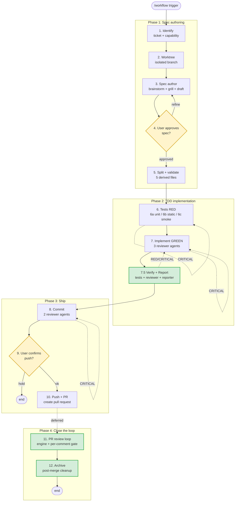
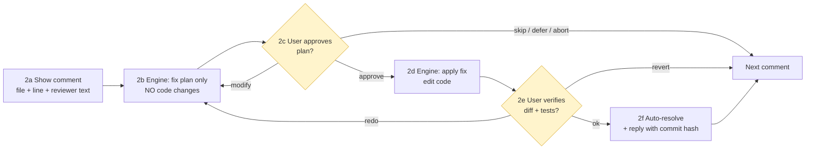

# Spec-Driven Development Pipeline

A 12-stage pipeline that takes a feature from intent to archived spec, with mandatory verification gates and parallel reviewer agents at each step.

Designed for AI-assisted, spec-first workflows. Tool-agnostic where possible — see [Customization](#customization) for substitution points.

---

## Table of Contents

- [Core Principles](#core-principles)
- [Pipeline Overview](#pipeline-overview)
- [Stage Table](#stage-table)
- [Stage Details](#stage-details)
- [Stage 7.5 vs Stage 11](#stage-75-vs-stage-11)
- [Reviewer Dispatch Pattern](#reviewer-dispatch-pattern)
- [Fast Mode](#fast-mode)
- [Skip Rule](#skip-rule)
- [Resume Entries](#resume-entries)
- [Customization](#customization)
- [File Layout](#file-layout)
- [Common Mistakes](#common-mistakes)

---

## Core Principles

1. **Every change traces to a spec.** No code without a `spec.md`.
2. **Single source of truth.** Authors edit one file; derived artifacts are projections.
3. **Verification before commit.** No commit until tests are green and there are zero CRITICAL spec violations.
4. **Lifecycle ends at archive, not at push.** PR review and post-merge archive are part of the pipeline.
5. **Per-comment user gate in review fixes.** The fix engine never batches multiple PR comments without human approval per item.
6. **Reviewer agents in parallel, never serial.** Multiple reviewer personas at each stage are dispatched in a single message.
7. **CRITICAL blocks; WARNING/SUGGESTION surfaces.**

---

## Pipeline Overview



Legend: yellow = user gate, green = stage added in this revision.

---

## Stage Table

| #    | Stage              | Trigger              | Action                                                            | Reviewers   | Output                          | User gate           |
| ---- | ------------------ | -------------------- | ----------------------------------------------------------------- | ----------- | ------------------------------- | ------------------- |
| 1    | Identify           | `/workflow`          | ticket + capability decision + `{name}`                           | —           | name, ticket, MODIFIED/ADDED    | —                   |
| 2    | Worktree           | auto                 | new spec → mandatory `.worktrees/{name}`                          | —           | correct branch                  | —                   |
| 3    | Spec author        | auto                 | inline brainstorm + grill + draft `spec.md`                       | —           | `spec.md` (source of truth)     | —                   |
| 4    | Approve spec       | user                 | review `spec.md`                                                  | —           | approve / refine                | yes                 |
| 5    | Split + validate   | auto                 | derive 5 files; run validator                                     | —           | 6 files                         | —                   |
| 6    | Tests (RED)        | auto                 | unit / static / smoke per mode                                    | 3 / 2 / 0   | failing tests / script / list   | —                   |
| 7    | Implement (GREEN)  | auto                 | production code → tests GREEN                                     | 3           | reviewed code                   | —                   |
| 7.5  | Verify + Report    | auto                 | test gate + spec-vs-code review + coverage report                 | —           | `report.md` + 0 CRITICAL        | —                   |
| 8    | Commit             | auto                 | conventional commit + spec footer                                 | 2           | local commit                    | —                   |
| 9    | Confirm push       | user                 | view diff stats + branch + remote                                 | —           | push / hold                     | yes                 |
| 10   | Push + PR          | auto                 | `git push` + create pull request                                  | —           | remote branch + PR              | —                   |
| 11   | PR review loop     | deferred             | fix engine + per-comment gate + auto-resolve                      | —           | resolved discussions, merged    | yes (2 per comment) |
| 12   | Archive            | user (post-merge)    | archive spec + worktree cleanup + tracker close                   | —           | spec archived, env clean        | yes                 |

---

## Stage Details

### Stage 1 — Identify

Establish ticket + capability scope.

- Prompt user for **ticket ID** (issue tracker). Optional for personal/exploratory work.
- Prompt user for **one-line feature description**.
- Derive `{name}` (kebab-case).
- List existing capabilities (archived in spec tree + in-progress in other changes).
- Decide: attach to existing capability (**MODIFIED**) or create a new one (**ADDED**).
- If `openspec/changes/{name}/` already exists → ask user which stage to resume from.

### Stage 2 — Worktree

Create isolated workspace.

```bash
git worktree add .worktrees/{name} -b feat/{branch_name} <base_branch>
cd .worktrees/{name}
```

Rule: new specs MUST NOT work in the main repo. Resume of existing change → reuse existing worktree or current branch.

### Stage 3 — Spec author

Inline brainstorm + optional grill round, then draft `spec.md`.

Sections:

- `# {Feature Name}`
- `## Why`, `## What`, `## Impact`
- `## Design` (optional)
- `## Requirements` (Requirement → nested Scenarios)
- `## Tasks`

`spec.md` is the **single source of truth**. The 5 derived files in Stage 5 are projections — users edit only `spec.md`.

### Stage 4 — Approve spec (user gate)

User reads `spec.md`. Approve or refine (loop back to Stage 3).

### Stage 5 — Split + validate

Project `spec.md` into 5 derived files in the same folder:

```
openspec/changes/{name}/
├── spec.md                ← single source of truth (KEEP)
├── .openspec.yaml         ← metadata (derived)
├── proposal.md            ← Why + What + Impact (derived)
├── design.md              ← Design (derived)
├── specs/{name}/spec.md   ← Requirements with ADDED/MODIFIED prefix (derived)
└── tasks.md               ← Tasks (derived)
```

Run the spec validator. Fix errors by editing `spec.md` and re-splitting. **Never edit derived files by hand.**

### Stage 6 — Tests (RED)

Classify spec type by Scenario fingerprints:

| Mode                       | Fingerprints                                              | Output                | Reviewers                                |
| -------------------------- | --------------------------------------------------------- | --------------------- | ---------------------------------------- |
| **6a Unit-test**           | runtime entities (state holders, controllers, data sources), `WHEN <user action>`, `WHEN <external system returns>` | failing unit tests    | 3 (coverage, isolation, quality)         |
| **6b Static-validation**   | `WHEN inspect <file>`, `THEN NOT contains <pattern>`      | assertion script      | 2 (coverage, correctness)                |
| **6c Manual-smoke**        | on-device install + verify, post-build artifact inspection, smoke matrix | `smoke-checklist.md`  | 0 (no automated review possible)         |

Confirm tests/script fail with current code (true RED). For Mode 6c there is nothing to automate yet — proceed.

A spec may be **mixed**: fall through modes for the matching subset of Scenarios.

### Stage 7 — Implement (GREEN)

Implement production code until tests are GREEN.

Dispatch **3 parallel reviewer agents** (single message, 3 tool calls):

- `review-spec-compliance` — every `SHALL` / Scenario satisfied
- `review-code-quality` — linting, project conventions, layering rules, error-handling and safety invariants (specifics defined by the project's `code-reviewer` skill)
- `review-edge-cases` — error paths, boundaries, concurrent access, off-by-one

CRITICAL → fix → re-dispatch same reviewers.

### Stage 7.5 — Verify + Report

Mandatory gate before any commit.

1. **Test gate**: run full test suite (scoped to changed modules if monorepo). RED → loop back to Stage 7.
2. **Verify**: invoke `code-reviewer` agent — compares spec line-by-line against implementation. Must return **0 CRITICAL**. Any CRITICAL → loop back to Stage 7.
3. **Report**: invoke `reporter` agent → write `openspec/changes/{name}/report.md` containing:
   - Requirement × Scenario coverage matrix
   - Spec vs implementation diff
   - Outstanding issue list
4. Surface report summary inline so user sees coverage before commit.

For Mode 6c (manual-smoke) specs: skip the test gate (no automated tests); still run verify + report against the smoke checklist; user must complete the smoke matrix manually before Stage 9.

### Stage 8 — Commit

Compose conventional commit with spec footer:

```
{type}({scope}): {description} [TICKET-XXX]

{optional body}

Spec: openspec/changes/{name}/specs/{name}/spec.md
Scenarios: scenario-1, scenario-2
AI-assisted: yes
```

Dispatch **2 parallel reviewer agents**:

- `review-commit-message` — type/scope correct, footer complete, ticket reference present
- `review-changeset` — diff matches description, no scope creep, no stray files

CRITICAL → fix → re-dispatch. Then `git commit`.

### Stage 9 — Confirm push (user gate)

Show: commit hash, subject, diff stats, branch name, target remote. User: push or hold.

### Stage 10 — Push + PR

```bash
git push origin "feat/{branch_name}"
# GitHub:
gh pr create --base <integration_branch> --title "..." --body "..."
# GitLab:
glab mr create --target-branch <integration_branch> --title "..." --description "..."
```

PR description includes spec path + ticket link.

### Stage 11 — PR review loop

Deferred trigger. After push, reviewers may take hours or days. User re-enters via:

```
/workflow --pr-loop {PR_ID}
/workflow --pr-loop {PR_URL}
```

#### Step 0: Engine detection

Default to `codex`; fall back to `claude` if codex CLI is unavailable.

```bash
codex_available=false
if command -v codex >/dev/null 2>&1 \
   && [ -d "$HOME/.claude/plugins/marketplaces/openai-codex" ]; then
    codex_available=true
fi
```

| Engine            | Trigger                  | Dispatch                                                       |
| ----------------- | ------------------------ | -------------------------------------------------------------- |
| codex (default)   | `codex_available=true`   | `Agent(subagent_type="codex:codex-rescue", prompt=...)`         |
| claude (fallback) | codex unavailable        | `Agent(subagent_type="general-purpose")` + fixer skill         |

The engine is fixed for the entire loop. Override with `/workflow --pr-loop {PR} --engine=claude`.

#### Step 0.5: Codex prompt template (codex engine only)

Codex does **not** automatically use Claude Code skills. It only reads `<repo>/AGENTS.md`, `~/.codex/AGENTS.md`, repo files, and the prompt we send. Long-lived rules belong in `AGENTS.md`; per-comment context belongs in the prompt.

Two prompts per comment — **Step 2b (plan only)** and **Step 2d (apply fix)**:

**Step 2b — PLAN ONLY:**

```
You are continuing on an in-progress PR. Produce a fix PLAN for the
review comment below. THIS RUN IS PLAN ONLY — DO NOT edit any files,
DO NOT commit, DO NOT run tests yet.

## PR context
- Repository: {repo_root}
- PR: #{PR_ID}, branch: {branch_name}
- Base: {integration_branch}
- Related spec: openspec/changes/{name}/specs/{name}/spec.md
- Relevant Scenario(s):
  {paste Requirement + Scenario verbatim}

## The reviewer comment
- File: {file_path}:{line_number}
- Severity: {CRITICAL | WARNING}
- Reviewer: {reviewer_name}
- Body (verbatim):
  > {comment body}

## Output (markdown)
1. Files to edit
2. Changes per file (1-3 bullets)
3. Spec mapping (which Scenario)
4. Side-effects / risks
5. Confidence: low / medium / high
6. Open questions (if any)

## Hard rules
- Plan only. No edits, no commits, no test runs.
- Minimal scope — this comment only, no drive-by refactoring.
- If the comment contradicts the spec, flag it in Open questions.
- If context is insufficient, reply "INSUFFICIENT CONTEXT" and list what is needed.
```

**Step 2d — APPLY (after user approves the plan):**

```
The plan you produced was approved. Apply the fix now.

## PR context
(repeat the same context block as Step 2b verbatim)

## The approved plan
{paste approved plan from 2b, with any user `modify` adjustments}

## Now
1. Apply changes exactly as planned.
2. Run tests: {test_command}
3. Commit locally:

   fix(review): {scope} address {file}:{line} - {summary}

   Comment: {reviewer_name} on {file}:{line}
   PR: #{PR_ID}
   Spec: openspec/changes/{name}/specs/{name}/spec.md
   Scenarios: {scenario-name}
   AI-assisted: codex

4. Do NOT push. Do NOT resolve discussion (pipeline handles 2f).

## Output
- Files changed (with +/- line counts)
- Test result
- Commit hash
- Deviation from plan (if any)
- Self-doubt — anything the human should check at 2e
```

**Sanity check before dispatching codex**: spec section pasted verbatim (not just path), comment body verbatim, test command correct for this repo, commit footer template includes Spec + Scenarios + AI-assisted, "do not push / do not resolve" present.

#### Step 1: Fetch + classify

```bash
# GitHub:
gh pr view {PR_ID} --json comments,reviews --jq '...'
# GitLab:
glab api projects/:id/merge_requests/{MR_ID}/discussions
```

Classify each comment by severity: CRITICAL / WARNING / SUGGESTION.

- SUGGESTION: list to user once; user decides batch absorb / skip. Bypasses the per-comment loop.
- CRITICAL / WARNING: enter Step 2.

#### Step 2: Per-comment checkpoint loop (user gate × 2 per comment)

For each CRITICAL / WARNING comment:



User options at **2c (approve plan)**:

| Option            | Behavior                                                  |
| ----------------- | --------------------------------------------------------- |
| `approve`         | Proceed to 2d, engine applies the fix                     |
| `modify <text>`   | User refines the plan; engine re-plans (back to 2b)       |
| `skip`            | Leave unresolved; reviewer decides; next comment          |
| `defer`           | Mark deferred; revisit at end of loop                     |
| `abort`           | Stop Stage 11; remaining comments not processed           |

User options at **2e (verify diff)**:

| Option           | Behavior                                                  |
| ---------------- | --------------------------------------------------------- |
| `ok`             | Auto-resolve discussion (2f) + next comment               |
| `redo <hint>`    | Engine re-plans (back to 2b)                              |
| `revert`         | `git checkout -- <files>` to undo; mark deferred          |

**Forbidden**: batching multiple comments before user approval. This defeats the design: user catches engine drift on the first wrong comment instead of accumulating bad fixes.

#### Step 3: After all comments

Re-run **Stage 7.5** (test + verify + report) once to catch regression. Loop back to Step 2 for any deferred items.

#### Step 4: Push update

Default: **one commit per comment** (per-comment commit), making diff review and selective revert easy. Override with `--squash`.

#### Step 5: Detect merged

Poll PR state (`gh pr view --json state` / `glab mr view --output json | jq .state`). `merged` → jump to Stage 12.

Exit conditions:

- All CRITICAL/WARNING resolved (approved or skipped or deferred-then-resolved) + no deferred remaining + reviewer approves + PR merged → Stage 12.
- User `abort` → Stage 11 exits, PR stays open, already-applied fixes remain pushed.

### Stage 12 — Archive (post-merge, user-triggered)

User triggers archive after the PR is merged. The pipeline does **not** auto-archive — premature archive moves the spec out of `openspec/changes/` while the PR may still reference it.

1. Move spec folder to `openspec/changes/archive/YYYY-MM-DD-{name}/`.
2. Merge into `openspec/specs/{capability}/spec.md`:
   - ADDED → new section
   - MODIFIED → integrate diff into existing capability
3. **Worktree cleanup**: `git worktree remove .worktrees/{name}` + delete local branch (`git branch -d feat/{branch_name}`). Remote branch is auto-deleted if the PR was configured to delete source branch on merge.
4. Update ticket tracker (close issue) + project memory (remove from active list).

---

## Stage 7.5 vs Stage 11

|                  | Stage 7.5                                  | Stage 11                                                       |
| ---------------- | ------------------------------------------ | -------------------------------------------------------------- |
| Trigger          | auto, pre-commit                           | deferred, post-PR-comments                                     |
| Source           | spec                                       | reviewer comments                                              |
| Action           | reviewer + reporter + tests                | fix engine (codex/claude) + auto-resolve                       |
| Human gates      | none (auto pass/fail)                      | **2 per comment** (approve plan + verify diff)                 |
| Exit             | 0 CRITICAL → commit                        | all resolved + merged → archive                                |

---

## Reviewer Dispatch Pattern

When a stage says "dispatch N parallel reviewer agents":

1. Compose **one message** with N agent tool calls (single-message multi-tool-use).
2. Each agent gets the same artifact + persona-specific prompt.
3. In **fast mode**, N drops to 1 (combined persona prompt).
4. Aggregate findings by severity: CRITICAL (block) > WARNING (surface) > SUGGESTION (note).
5. **De-duplicate**: when two reviewers raise the same item, merge into one entry; tag which reviewers flagged it. Sort SUGGESTIONs by ROI (impact / effort).
6. CRITICAL → fix → re-dispatch the same reviewers with the post-fix artifact.
7. After pass, append aggregated summary to `openspec/changes/{name}/review.md`. Do **not** store individual agent raw reports.

### `review.md` format (append-only, one section per stage)

```markdown
# Review log: {Feature Name}

## Stage 6 Tests (YYYY-MM-DD)

- Mode: 6a / 6b / 6c, full / fast
- Reviewers: review-test-coverage / review-test-isolation / review-test-quality
- Iterations: N
- Token usage: ~X k total

### CRITICAL
_(none)_

### WARNING
_(none)_

### SUGGESTION
1. {short} — flagged by: {reviewer names}
2. ...

### Verdict
PASS / BLOCK
```

---

## Fast Mode

For small scope (≤ 3 Scenarios in spec OR < 100 LoC diff):

- Each reviewer stage drops from N agents → 1 combined reviewer.
- Saves ~2/3 reviewer tokens.
- Triggers:
  - explicit: `/workflow --fast ...`
  - auto-detected at end of Stage 5 (count Scenarios in derived `specs/{name}/spec.md`)
  - override: `--full` forces full mode

---

## Skip Rule

Trivial UI tweaks (color or spacing only, no behaviour change) MAY bypass the pipeline with a plain `style:` / `chore:` commit. If unsure, run the pipeline.

---

## Resume Entries

```
/workflow --from {stage} --spec {name}    # stage ∈ tests, implement, commit, push
/workflow --pr-loop {PR_ID}               # jump to Stage 11
<archive-command> {name}                  # Stage 12, outside pipeline
```

Stage 1 also auto-detects existing `openspec/changes/{name}/` and offers resume options.

---

## Customization

This pipeline is tool-agnostic. Substitution points:

| Slot                | Default                                          | Alternatives                                                 |
| ------------------- | ------------------------------------------------ | ------------------------------------------------------------ |
| Spec system         | OpenSpec                                         | Custom markdown, RFC, ADR                                    |
| VCS host            | GitHub (`gh`) / GitLab (`glab`)                  | Bitbucket, Gitea, Forgejo                                    |
| Integration branch  | `main`                                           | `develop`, `release`, `integration`                          |
| Test command        | project-specific                                 | `npm test`, `pytest`, `./gradlew test`, `cargo test`         |
| Fix engine          | `codex:codex-rescue` agent                       | Any code-writing agent + fixer skill                         |
| Reviewer agents     | `code-reviewer`, `reporter`, etc.                | Custom agents per project                                    |
| Ticket tracker      | Linear / Jira / GitHub Issues                    | Any                                                          |

To adapt: copy this file, substitute the slot values, and replace the commands in Stages 5, 7.5, 10, 11, 12 accordingly.

---

## File Layout

```
<repo>/
├── openspec/
│   ├── changes/
│   │   ├── {name}/
│   │   │   ├── spec.md             ← source of truth (Stage 3)
│   │   │   ├── proposal.md         ← derived (Stage 5)
│   │   │   ├── design.md           ← derived (Stage 5)
│   │   │   ├── tasks.md            ← derived (Stage 5)
│   │   │   ├── specs/{name}/spec.md ← derived (Stage 5)
│   │   │   ├── .openspec.yaml      ← derived (Stage 5)
│   │   │   ├── review.md           ← reviewer log (Stages 6, 7, 8)
│   │   │   ├── report.md           ← Stage 7.5 output
│   │   │   └── smoke-checklist.md  ← Mode 6c only
│   │   └── archive/
│   │       └── YYYY-MM-DD-{name}/  ← moved here in Stage 12
│   └── specs/
│       └── {capability}/spec.md    ← merged from archived changes
└── .worktrees/                     ← per-change isolated worktrees
```

---

## Common Mistakes

| Mistake                                                 | Correction                                                                                                |
| ------------------------------------------------------- | --------------------------------------------------------------------------------------------------------- |
| Skipping Stage 7.5 in auto mode                         | Pipeline contract — commit blocked until 0 CRITICAL + green tests + report generated.                     |
| Treating push as pipeline end                           | Pipeline ends at Stage 12 archive. Push only ships a candidate.                                           |
| Auto-archiving before merge                             | Stage 12 is user-triggered, post-merge.                                                                   |
| Forgetting worktree cleanup                             | `git worktree remove` is part of Stage 12. Stale worktrees confuse Stage 1 detection.                     |
| Batching PR comment fixes                               | Stage 11 mandates per-comment gate × 2 (plan + verify).                                                   |
| Mid-loop engine swap                                    | Engine fixed at Step 0. Mid-loop swap breaks fix-quality attribution + risks double-apply / missed commit. |
| Engine writing code at Step 2b                          | Plan only at 2b. Code only at 2d after user approves plan.                                                |
| Editing the 5 derived files by hand                     | Edit `spec.md` and re-split. Derived files are projections.                                               |
| Dispatching reviewers sequentially                      | One message, N tool calls = parallel.                                                                     |
| Storing N individual reviewer reports as separate files | Append aggregated summary to `review.md` only.                                                            |
| Forcing unit tests on a build-config-only spec          | Use Mode 6b (static-validation) or 6c (manual-smoke).                                                     |
| Running `code-reviewer` / `reporter` inside Stage 7     | Keep them in Stage 7.5 — peer review vs compliance gate are distinct roles.                               |

---

*Pipeline lifecycle: ticket → spec → tests → implementation → verify → commit → push → review fix → archive.*
