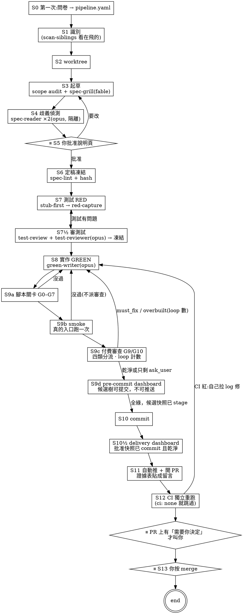

# workflow

端到端 pipeline。**你固定出現兩次:批准說明頁、按 merge。中間只在 PR 上有「需要你決定」時才叫你。
沒有一次需要讀程式碼。**

## 五條核心規則

**1. 證據規則。** 每一句「這是對的」都必須跑得出來。AI 提出的問題必須附**可執行的重現**
(會紅的測試 / 存活的變異 / 會命中的指令);跑不出來就自動作廢,不需要任何人裁決。
這條取代了舊版整套 severity rubric 與人工裁決 gate。

**2. 凍結規則。** 規格在人類批准後凍結,規格測試在 RED 後凍結。要改是**明確事件** ——
退回重跑、重新擷取證據、留紀錄。不是偷偷改測試讓它變綠。

改動要不要**重新批准**,由 `scripts/gates/spec-diff` 機械判定,不靠人自己認定:

| 改了什麼 | 判定 |
|---|---|
| `examples` 的 `in` / `out`、`then`、`mode`、Scenario 被移除、覆蓋改成 N/A | **行為改變 → 退回 S5 重新批准** |
| 新增 Scenario、新增 example、N/A 補成有覆蓋 | 收緊,不擋(列出來讓人知道) |
| `why` / `design` / `impact` / `tasks` | 事實修正,不需重新批准,但**列在證據表上** |

**為什麼不讓實作者自己認定「這只是事實修正」:** 那等於把裁量權還回去,
而凍結規則存在的全部理由就是拿掉那個裁量權。人類批准的是**那些具體例子** ——
例子變了就給他看一眼,五秒鐘的事,比一個自我認證的判斷可靠得多。

**3. 成本規則。** 腳本關卡全綠、**smoke 過**,才啟動付費關卡。
絕不花錢請 AI 去審一個腳本本來就會擋掉的東西;**功能不對,其他免談** ——
smoke 沒過就連審都不審。

**4. 隔離規則。** 獨立讀者看不到程式碼 —— 這是它存在的**全部理由**。
程式和測試是同一個模型從同一份規格產生的,兩邊很可能一起誤讀;
只有沒被汙染的讀者抓得到。給它看實作等於廢掉這道防線。

> ⚠️ **不要用 agent 清單確認隔離。** 定義裡的 `tools: []` 在系統的 agent 清單上
> 會被渲染成 `Tools: All tools`(空陣列被當成「未指定」)。有工具的 agent 顯示正確,
> **只有零工具的顯示錯**。實測確認實際行為是零工具:派出去要它讀檔,
> 它回報「沒有可以發出讀取請求的管道,連發出後失敗都沒有發生」,harness 側 `tool_uses: 0`。
> 但只看清單的人會以為隔離沒生效 —— 或更糟,以為生效了卻其實沒設。
> 要確認就實際派一次、叫它讀一個檔案。

**5. 缺席規則。** 「必須附重現」會系統性低估**缺席類**問題(沒接進導航、沒有呼叫點)——
東西不存在時寫不出失敗測試。所以可達性(G7)是獨立的機械關卡,和嚴重度分開排。

**6. 夠了規則。** 做到哪算夠 = **你批准的那些 examples,一個字不多。**
例子外的實作叫多做:多出來的公開介面 / 抽象層會被擋(`overbuilt`),內部囉嗦只提醒(`style`)。
例子外的**問題**不是 fix,是**問題** —— 審查者發現例子沒涵蓋的 bug 或極端 edge case,
不准自己修,變成 PR 上一則「要不要防?」問你(`ask_user`)。你說要 → 加一組 example
(收緊,不用重新批准);你說不用 → 記成已接受風險。
這條也是迴圈會收斂的原因:審查者不能一直加新要求,只能問。

## Skip rule

純樣式微調(顏色/間距,無行為變更)可以直接走 `style:` / `chore:` commit,不跑這條線。不確定就跑。

## Project bindings

兩層設定:

**`<repo>/specs/pipeline.yaml`** —— 機器可讀,給關卡腳本用。**第一次在一個專案跑,先走 S0 問卷把它填齊:**

```yaml
runner: swift-testing            # red-capture 的輸出解析器
tests:
  globs: ["Packages/*/Tests/**/*.swift", "MindEYTests/**/*.swift"]
  scenario_pattern: '@Test\(\s*"(SC-\d+[a-z]?)'
reachability:
  globs: ["App/**/*.swift"]      # G7 在哪裡找建構點
lint: "swiftlint lint --quiet"   # 會接變更檔的路徑
test: "./scripts/verify.sh"      # 沒設 = G4 失敗
smoke: "./scripts/smoke.sh"      # 用真的入口跑一次;沒設 = S 失敗
integration_branch: main
auto_push: true                  # 全綠零待決 → 自動推功能分支 + 開 PR
ci: github                       # none | github | gitlab;none 就沒有 S12
rules_files: [AGENTS.md]         # 資安基準與架構鐵則;派給 green-writer / code-adversary
```

`scripts/gates/config-check` 會列出還沒填的鍵。沒填的鍵讓對應關卡**失敗**,不是跳過。

**`<repo>/AGENTS.md`** —— 給 AI 讀的散文:`{TEST_COMMAND}`、`{BUILD_COMMAND}`、
`{LAYERING_CONVENTION}`、`{INTEGRATION_BRANCH}`、`{TICKET_PREFIX}`、Security Baseline、專案鐵則。

**專案自備的 skill 只剩兩個**(舊版六個,其餘已被腳本與內建 agent 取代)。
內建的 `red-writer` / `green-writer` 會在派遣時讀它們,拿到 stack 的慣例:

| 慣例名 | 用在 | 專案要提供 |
|---|---|---|
| `test-writer` | S7 | 這個 stack 怎麼寫測試、stub 怎麼放 |
| `rd-implementer` | S8 | 這個 stack 怎麼分層實作 |

## Process



## Stages

### S0 第一次用這個專案:問卷

`specs/pipeline.yaml` 不存在(或 `config-check` 說有缺)→ **先問,再開始。** 用 `AskUserQuestion`,
一次一組,不知道怎麼答的給預設值和例子;答案寫進 `specs/pipeline.yaml`,之後不再問。

| 組 | 問什麼 | 寫到 |
|---|---|---|
| 技術棧 | 測試框架(決定 `runner` 解析器)、測試檔在哪、測試怎麼標 SC-id | `runner` `tests.globs` `tests.scenario_pattern` |
| 指令 | 跑測試、lint(接檔案路徑)、**smoke**(起 app 截圖 / 打端點 / 跑 CLI) | `test` `lint` `smoke` `smoke_timeout` |
| 版本 | 整合分支叫什麼、能不能自動推功能分支、有沒有 CI(github / gitlab / 沒有) | `integration_branch` `auto_push` `ci` |
| 邊界 | G7 去哪些目錄找建構點、資安基準與架構鐵則在哪個檔 | `reachability.globs` `rules_files` |

smoke 沒有的專案要在這裡**一起寫出來**(通常是一支 `scripts/smoke.sh`),
因為沒有 smoke 這條線跑不到付費審查。`ci: none` 是合法答案 —— 那就沒有 S12,證據只靠本機 + git。

跑完 `scripts/gates/config-check` 必須 PASS。詳見 `commands/workflow/init.md`。

### S1 識別

1. 問 ticket id(可跳過)、一句功能描述
2. 記錄 `{name}`(kebab-case)與分支名 `feat/[{TICKET}-]{name}`
3. **跑 `scripts/gates/scan-siblings`** —— 列出所有 worktree 在飛的能力。
   同名能力會預警。已落地(在整合分支上)的規格會被濾掉,不算在飛。
4. `specs/{name}/` 已存在 → 問要從哪一階段續跑

### S2 Worktree

新規格一律開新的 linked worktree,除非人明說跳過。

```bash
base="{INTEGRATION_BRANCH}"   # AGENTS.md;沒綁定就停下來問,絕不猜
git show-ref --verify --quiet "refs/heads/${base}" || base="origin/${base}"
git worktree add .worktrees/{name} -b "feat/${branch_name}" "$base" && cd .worktrees/{name} || exit 1
```

續跑時**用精確 ref 比對**解析 worktree,絕不用 unanchored grep ——
有 `-v2` 之類的兄弟分支時會誤中,接著 `cd ""` 靜默留在主目錄。

```bash
wt="$(git worktree list --porcelain \
      | awk -v b="refs/heads/feat/${branch_name}" \
            '/^worktree /{w=substr($0,10)} $0==("branch " b){print w; exit}')"
[ -n "$wt" ] && { cd "$wt" || exit 1; }
```

### S3 起草

1. **Scope audit(必做)** —— 任何「N 個檔案 / N 個呼叫點」的宣稱都必須來自
   **全 codebase grep**,不是 Explore subagent 的抽樣。而且要 grep **呼叫點本身**,
   不是 import(wildcard import 與完全限定呼叫會被漏掉)。
2. 草擬 `specs/{name}/spec.yaml`(見 `references/spec-template.yaml`)
3. **派遣 `spec-grill`**(模型由它的定義決定,派遣時不傳 `model`) —— 完備性挑戰 + 洞 + **它自己的解讀表**
   (兼任 S4 的第一個讀者,省一次派遣)
4. **跑 `scan-siblings specs/{name}/spec.yaml`** —— 比對 `impact.files`,
   把會跟其他在飛分支撞的檔案列出來。在寫程式之前知道,比合併時才發現便宜得多。

### S4 歧義偵測

派遣 **2 個 `spec-reader`**(`tools: []`,規格直接貼在 prompt 裡)。
兩種視角:**字面讀者**、**敵意讀者**。

加上 grill 的表共三張,機械比對:

| 比對結果 | 意義 |
|---|---|
| 同 SC-id、同 input、**不同 output** | **分歧** → 變成人類的選擇題 |
| 一邊有這個 input,另一邊沒有 | 覆蓋落差 → 列出來,較弱的訊號 |
| 完全一致 | 兩個獨立讀者理解相同 → 直接寫進規格的 `examples` |

**`examples` 就是契約** —— 它同時是可測性的定義、也是測試本身。
敵意讀者要額外質疑**範例資料本身**:那組資料分得出正確與錯誤的實作嗎?

### S5 ⏸ 你批准說明頁

用 `eli5` skill 產一頁 HTML。內容:

- 白話說明這個功能做什麼
- **分歧選擇題**(來自 S4)
- **「我主張不需要處理」的清單**(六類遺漏裡寫 N/A 的,附理由)
- 受影響的檔案 + 跨分支碰撞警告
- 具體例子用**真實數值**寫 —— 那是人最容易一眼看出「這不是我要的」的形式

你做的事:回答分歧、挑戰 N/A、確認意圖。**不讀規格,不讀程式碼。**

批准後**必須存下快照** `evidence/spec.approved.yaml` ——
沒有快照就無從判斷後續改動要不要重新批准。
批准是 owner 的流程事實；機器只能驗證快照是否已被 commit 錨定。
只有 staged 的快照是 `pending_commit`，**不是「已批准」的證據**。

### S6 定稿凍結

1. 把批准內容寫回 `examples`
2. **反向回譯檢查** —— 從規格生成一份說明頁,跟你批准的那份比對。
   防「你批准的和機器建的不是同一件事」
3. `scripts/gates/spec-lint` 必須 PASS
4. hash 凍結 → `specs/{name}/evidence/spec.hash`

### S7 測試 RED

**派遣 `red-writer`**。派遣訊息給它:凍結的規格路徑、專案 `test-writer` skill 的路徑、
測試指令。它寫完會回報 `red-capture` 的輸出原文;**只回「完成」的報告不接受**。

強制 **stub-first**。`compile-fail-as-RED` 不接受 —— 編譯不過不證明任何斷言有效。

**stub 必須回傳/拋出「沒有任何 Scenario 預期的東西」:**

- 回 `[]` 會讓「空清單」那條在實作前就綠 → 空測試
- 靜默成功會讓「不報錯」那條在實作前就綠 → 空測試
- 所以:清單回**哨兵列**、void 拋**哨兵錯誤**

而且**測試要斷言具體錯誤訊息**,不只斷言型別 —— 否則哨兵的 `.validation` 會把
預期 `.validation` 的測試矇混過去。

順序(這個順序是實測教訓):

```
寫測試 → 跑格式化 → 跑測試 → red-capture → 凍結測試檔
         ↑ 先格式化,否則之後修 lint 會讓凍結指紋失效
```

`scripts/gates/red-capture` 需要 `evidence/red-inputs.json` 列出各層的輸出檔與測試檔。

`mode` 同時決定證據階段,不是只有 schema 標籤:

| mode | S7 / S7½ | 後續 |
|---|---|---|
| `6a` 單元測試 | 必須有 true RED、逐 example 審查並凍結 | G4 必須 GREEN |
| `6b` 靜態 assertion | 必須有 RED 與逐 example 追溯,不可跟 6c 一起略過 | G4 的專案 test 指令必須轉綠 |
| `6c` build artifact／可驅動 smoke | 明確列為 deferred,不准寫假的 `@Test` 充數 | S9b 必須逐 Scenario/example 交實跑檔案證據 |
| `6d` 只能人工 | 不進自動測試證據；`manual_reason` 必填 | 證據表列為人工待驗 |

任何未知或缺少的 mode 都 fail closed；不能因為不在某階段集合裡就靜默免驗。

### S7½ 審測試,再凍結

**凍結錯的測試比沒凍結更糟** —— 實作者只能一直「衝突就停」。所以上鎖前:

1. `scripts/gates/test-review specs/{name}/spec.yaml --mechanical-only` —— 對 6a/6b 檢查零斷言、
   沒引用 example 具體值、example 沒人測,三種都擋
2. **派遣 `test-reviewer`**(只有 Read/Grep/Glob)—— 看機械抓不到的:斷在對不對的地方、
   一條測試一件事、case 名稱讀得出 given/when/then。它寫 `evidence/test-review.agent.json`
3. 再跑一次 `test-review`(不帶 `--mechanical-only`)→ PASS 才 hash 凍結測試檔
4. 有問題 → 退回 S7 改測試,**重新擷取 RED**(改過的測試沒有 RED 證據)

`test-review.json` 會記下每個測試檔的指紋;dashboard 的 G2b 確認「審過的」和「凍結的」是同一批檔。

### S8 實作 GREEN

**派遣 `green-writer`**。派遣訊息給它:凍結測試的路徑、專案 `rd-implementer` skill 的路徑、
測試指令。「衝突就停」寫死在它的定義裡,不靠派遣訊息記得。

**為什麼現在敢外派:** 凍結規則把它圍住了。它最壞能做的是動規格或規格測試(G1/G2 擋)、
卡住(它回報)、寫出醜的 code(lint + 對抗審查咬)—— 失敗模式有界而且偵測得到。
沒有凍結的話,把契約交給 subagent 才危險。

**能動**:產品程式碼、`impl/` 命名空間的測試。
**不能動**:`spec/` 命名空間的測試、`spec.yaml`。兩個都靠 hash 在 S9 擋。

**做到哪算夠**寫在它的定義裡:只做 examples 涵蓋的事、不加例子外的公開介面、註解只寫為什麼。
它回報的「例子外的觀察」**不要叫它做** —— 留到 S9c 變成 `ask_user`。

**遇到「規格與現實衝突」時停下來回報,不要自己解決。**

實作到一半發現規格對環境的假設是錯的(SDK 行為跟規格寫的不一樣、既有慣例與規格牴觸),
此時有三條路,而只有第一條是對的:

1. ✅ 停下來,回報「規格說 X,實測是 Y」,讓 orchestrator 走改動流程
2. ❌ 自己改規格 —— 那是人批准過的契約,不是實作者能動的
3. ❌ 偷偷放寬測試讓它變綠 —— 凍結規則存在的全部理由

**外派給 subagent 時這條要寫進派遣訊息。** 第 2、3 條會在 subagent 內部發生,
然後被回報成「已完成」—— 因為 hash 是它改完之後才算的。

### S9 關卡:腳本 → smoke → 付費

**S9a 腳本關卡 G0–G7**(見下一節)。沒過 → 退回 S8。

**S9b smoke**:`scripts/gates/smoke specs/{name}/spec.yaml`。用真的入口跑一次、拿到真的結果 ——
UI 專案開 app 導航到目標畫面截圖(放進 `$SMOKE_SCREENSHOTS`)、API 打一次端點、CLI 跑一次指令。
**沒過就停在這裡,G9/G10 不派** —— 功能不對,審它幹嘛。退回 S8。

規格含 6c 時,整支 smoke 指令 exit 0 仍不夠。指令必須把逐 Scenario 結果寫到
`$SMOKE_RESULTS`,每條列 `id`、`ok:true`、涵蓋的 1-based `examples`,以及本輪放在
`$SMOKE_SCREENSHOTS`／`$SMOKE_ARTIFACTS` 的非空檔案證據(build log、request capture、
runner log、錄影、截圖或產物)。缺 Scenario、缺 example、`ok:false`、舊檔、不存在／空檔、
或只有 checklist 都讓 smoke FAIL。這是 6c 在 S7 被延後而不是被豁免的後半條防線。

**S9c 付費審查 G9/G10**:派 `spec-oracle` 與 `code-adversary`,**派完立刻
`scripts/gates/findings dispatched --gate G9 --model <實際用的模型>`(G10 同;退過級就加 `--degraded`)** —— 零 finding 的乾淨審查也要留下派過的紀錄,
否則「沒派」和「派了沒事」在證據上分不出來。每條 finding 用 `findings add` 收進來 ——
沒重現的 `must_fix` / `ask_user` / `overbuilt` **收不進去**;同一個重現換 id 重 add 也**收不進去**(計數會歸零)。
實跑重現:紅 → `set confirmed`;不紅 → `set void`。**停在 proposed 的 finding 算沒處理完**,擋 G9/10。然後分流:

| class | 然後 |
|---|---|
| `must_fix` | `loop fix F-n` → 修 → 重跑 G0–G7 + 那條重現 → 不紅了 `loop resolved` + `findings set fixed` |
| `overbuilt` | 同上,修 = 拿掉 |
| `ask_user` | **不修。** 留給 S11 的 PR 留言問人 |
| `style` | 記下,不動 |

`loop` 會在第 3 次 `fix` 拒絕(parked)、解過又出現時拒絕(flipflop)—— 那時停下來,
不是換個方式再修。`findings check` 乾淨(或只剩 `ask_user`)後，將這次 commit 的內容（含
`evidence/spec.approved.yaml`）stage，再跑：

```bash
scripts/gates/dashboard specs/{name}/spec.yaml --pre-commit
```

`--pre-commit` 只回答「候選樹能否 commit」；快照 staged 時只標記 `pending_commit`，絕不表示
owner 批准，也絕不允許 auto-push。這關全綠才進 S10。

### S10 Commit

```
{type}({scope}): {description} [{TICKET} if any]

{body:設計決定、驗證摘要、已知取捨}

Spec: specs/{name}/spec.yaml
Scenarios: SC-001, SC-002, ...
AI-assisted: claude
```

commit 後必須立即重跑預設（delivery）dashboard：

```bash
scripts/gates/dashboard specs/{name}/spec.yaml
```

只有 owner 批准快照存在 `HEAD` 且工作樹對該檔乾淨時，才是 `approval_anchor: committed`。
新快照未 commit、或已 commit 快照之後又被修改，delivery 關卡都必須 fail closed。

### S11 自動推 + 開 PR + 證據表貼成留言

```bash
scripts/gates/dashboard specs/{name}/spec.yaml     # commit 後的嚴格 delivery 裁決
git push -u origin "feat/${branch_name}"           # 只推功能分支;整合分支永遠不直推
gh pr create --base {INTEGRATION_BRANCH} --body-file <(scripts/gates/pr-comment specs/{name}/spec.yaml)
# 或 glab mr create --description "$(scripts/gates/pr-comment …)"
```

- `自動推:可以`(全綠、smoke 過、零待決事項、`auto_push: true`)→ 直接推、直接開 PR,**不叫人**
- `不行(有待決事項)`→ 一樣推、一樣開 PR,但留言頂端是「⏸ 需要你決定」+ 條列。人只看這一則
- `不行(有關卡沒過)`→ 不推,退回 S8
- `auto_push: false` → 停在這裡,把 `pr-comment` 的內容印給人,人說推才推

留言裡的每一項「需要你決定」都是**選擇題**,不是 code review:parked 的 finding(照樣出貨 / 停在這 / 改規格)、
`ask_user`(要防 → 加 example;不用 → 已接受風險)、規格改了要重新批准。

**整合分支受保護,永遠不直推。** 這條不因為「全綠」而例外。

### S12 CI 獨立重跑(`ci: none` 就跳過)

CI 是唯一**不在 AI 手裡**的執行環境 —— `evidence/` 全是 AI 在你機器上寫的,這一步讓它們得到外部確認。
`templates/ci/` 有 GitHub / GitLab 的範本,只跑腳本關卡 + `pr-comment`;要不要裝進專案是人的決定(改 CI 要人確認)。

**CI 紅了,orchestrator 自己去抓原因,不丟給人:**

```bash
gh run list --branch "feat/${branch_name}" --limit 1     # 或 glab ci list
gh run view <id> --log-failed                            # 拉失敗的 log
```

分兩種:**環境差異**(CI 上缺工具、路徑不同、權限)→ 修 CI 設定或 pipeline.yaml,重推;
**本機綠 CI 紅的關卡** → 那是本機證據不可信,退回 S8 當 `must_fix` 處理,走 `loop`。
兩輪還紅 → parked,PR 留言加一行「需要你決定」。整合分支動了 CI 會自動重跑,不用記得 rebase 後重驗。

### S13 ⏸ 你按 merge

PR 留言頂端是「✅ 全乾淨」→ 直接按。是「⏸ 需要你決定」→ 回答那幾題(在 PR 留言回,或直接跟 orchestrator 講),
orchestrator 處理完重新留言。**orchestrator 一律不代按 merge。**

## 關卡:順序就是花錢的順序

```
腳本判定 · 幾乎不花錢 · 全綠才往下
  G0  spec-lint        schema + 完備性六類 + 可測性
  G1  freeze-check     規格指紋 + **可解析性**(凍結一個載不進來的檔毫無意義)
                       指紋不符時跑 spec-diff 分類:行為改變 → 退回 S5;
                       事實修正 → 記錄後重新凍結
  G2  freeze-check     規格測試指紋
  G2b test-review      測試在凍結前審過,而且審的和凍結的是同一批檔
  G3  lint             **只看變更的檔案**。真實 repo 都有歷史債,要求整包乾淨
                       等於這關從第一天就失效。**既有債的基準線推給 lint 工具自己處理**
                       (例如 swiftlint 的 --baseline)—— 關卡不重造這個輪子
  G4  測試             跑 `specs/pipeline.yaml` 的 `test` 指令。
                       **沒設定 = 失敗,不是跳過** —— 「沒有人檢查」和「檢查通過」
                       是兩件完全不同的事。沒有這一關,RED 證據只證明實作前是紅的,
                       不證明實作後是綠的,GREEN 就還是「AI 說 OK」
  G5  red-capture      6a/6b:六類 + 三方對帳。6c 明列 deferred,**不是豁免**
  G6  traceability     6a/6b Scenario ↔ RED 測試雙向;6c 明列交 S9b
  G7  可達性           新增的型別有沒有人建構它
────────────────────────────────────────────
  S   smoke            用真的入口跑一次；6c 逐 Scenario/example 對到本輪實際檔案。
                       證據要新鮮(工作樹指紋對得上)。
                       **沒過,下面全部不跑**
────────────────────────────────────────────
付費判定
  G8   變異測試        有工具才跑;沒有就對關鍵斷言做定向變異
  G9   spec-oracle     opus,隔離,只憑規格寫驗收測試
  G10  code-adversary  fable,每條主張附可執行的重現,分四類
  G11  UI 截圖         smoke 順便截;有畫面變更才要求

**「每個 example 都有測試覆蓋」沒有獨立的關卡。** 由 spec-lint(每條 Scenario 必須有 examples)
+ traceability(每條 Scenario 必須有測試)+ test-review(每組 example 至少被一條測試引用值)
三邊夾住。**列一個不存在的關卡比少列一個更糟。**
```

### G5 的六類

| failure_class | 意義 | 處置 |
|---|---|---|
| `assertion` | 斷言評估過、值不對 | ✅ 最強證據 |
| `stub_sentinel` | 哨兵錯誤逸出,斷言沒跑到 | ✅ 可接受,較弱 |
| `error` | 其他錯誤逸出 | ❌ 擋 |
| `compile` | 編譯不過 | ❌ 擋 |
| `hang` | 測試沒跑完 | ❌ 擋,**最惡劣** |
| `passed` | 實作前就綠 | ❌ 擋,除非規格裡有 `red_exempt_reason` |

**`hang` 為什麼最惡劣:** 它沒有訊息可以分類,而且會讓**它後面的測試靜默不執行**。
所以對帳必須比對「原始碼宣告數 / runner 回報數 / 實際啟動數」三者 ——
只解析結果會把「有一條沒跑」誤報成全部通過。

錨點要用 **started 行**,不是最終結果行 —— 參數化測試不發單一最終結果行。

### G9 失敗了算誰的

人不讀程式碼,所以裁判必須是機械的。**規格的 `examples` 當裁判:**

| oracle 的斷言 | 處置 |
|---|---|
| 與某條 example **矛盾** | oracle 錯,自動作廢 |
| 與某條 example **一致**但實作沒過 | 實作有 bug → **擋** |
| 落在所有 example **之外**且紅了 | **`ask_user`** → 附問句上 PR 留言問人,**不擋、不修** |

第三列是設計**明確接受殘留風險**的地方:擋的話 oracle 可以無中生有任意需求,
迴圈永遠不收斂。代價是真有可能出貨一個 bug,所以它必須以問題的形式在 PR 上具名出現,
而你的答案(要防 / 不用)會被記下來。

### G10 的四類與重現形式

| class | 主張 | 重現 | 判定 |
|---|---|---|---|
| `must_fix` | 違反某組 example | 一條會紅的測試 | 跑得紅 → 修;跑得綠 → 作廢 |
| `must_fix` | 資安 / 架構違規(rules_files 的鐵則) | 一條會命中的指令 | 實際跑 |
| `must_fix` | 測試假綠 | 一個存活的變異 | 實際注入跑一次 |
| `ask_user` | example 沒涵蓋的 bug、極端 edge case | 一條會紅的測試 + 問句 | 紅 → 問人;綠 → 作廢 |
| `overbuilt` | 例子外的公開介面 / 抽象層 | 指名哪個介面沒有任何 example 用到 | 擋,拿掉 |
| `style` | 內部囉嗦、命名 | 不需要 | 提醒 |

成立的 `must_fix`,**那條重現測試直接進 `regression/` 命名空間** —— 白賺一條回歸測試。
`ask_user` 人說要防的,那條測試變成新 example 的規格測試(走 S7 重新擷取 RED)。

## 迴圈與收斂:由 `loop` 腳本數,不靠自律

```
loop <spec> fix F-n          第 3 次會被拒(parked);F-n 必須存在於 findings.json
loop <spec> resolved F-n     重現不紅了;parked / flipflop 之後**不能**用它自己解除
loop <spec> reappear F-n     解過又出現 → flipflop,立即停
loop <spec> redispatch G10   第 2 次會被拒
loop <spec> decided F-n ship|hold|respec   人在 PR 上決定了 —— 唯一能解除 parked / flipflop 的動詞
loop <spec> check            有沒有任何一條停住(dashboard 也讀)
```

人回答之後 orchestrator 做的事:`decided ship` → `findings set F-n accepted_risk`,重跑 dashboard,PR 留言變乾淨;
`decided respec` → 退回 S5 走規格改動;`decided hold` → 分支停在這,`runs --set` 標 blocked。

- 修完之後**重跑 G0–G7**(腳本,幾乎免費)+ 那條重現測試;smoke 只在 diff 碰到入口 / 導航時重跑
- **不重派 G9/G10**,除非 fix diff 跨超過一個檔或超過行數門檻;G10 最多重派 **1 次**
- 停下來不是叫你看程式碼,是 PR 留言上多一行「需要你決定」:
  「F-3 修 2 次未果 —— 照樣出貨 / 分支停在這 / 回頭改規格?」**這是決策,不是 code review。**

為什麼這樣就收斂:「這算不算問題」不能吵(跑得出來才算數);例子外的東西不能逼修(只能問);
修復次數有人在數(不會在同一個地方打轉)。

## 模型與額度

**模型只有一個來源:`agents/*.md` 的 frontmatter。派遣時不傳 `model`。** `pipeline.yaml` 沒有 `models` 鍵
(舊專案有也沒人讀)。主 session(orchestrator)用 opus —— 它做的是跑腳本、讀 JSON、分流,
拿最稀缺的模型跑這些是最差的用法。

Fable 額度只留給兩個地方:**S3 `spec-grill`**(一行程式沒寫就抓到的洞最便宜)和
**G10 `code-adversary`**(84 條 findings 裡 76 條、資安類 15 條裡 13 條是它抓的)。其他 agent 一律 opus。

**撞到 Fable 額度上限時**(派遣回來是 `You've reached your Fable limit`):
- `spec-grill` / `code-adversary` 用 `model: opus` **重派一次**,派完記
  `findings dispatched --gate G10 --model opus --degraded`。證據表會出「降級審查」標籤,不擋推,
  但你會看到這張卡的審查強度比平常低。
- **不准退到 sonnet**;也不准為了省額度先用 sonnet 派。
- 其他 agent 本來就不該碰 fable,撞到上限代表派遣時傳了 `model`,那是 bug。

實測(mindey-mobile 九天):24 次派遣空跑,20 次是 Fable limit;red-writer 設定 opus 卻有 19 次跑在 fable。
額度是被不該用它的地方吃掉的。

實測的派遣開機費(單次、零工作量):`general-purpose` 31,554 · `spec-grill`(3 工具)5,587 ·
`spec-reader`(零工具)3,137。**tool schema 佔了 general-purpose 開機費的九成** ——
所以派遣用的 agent 一律走 `agents/` 底下的精簡定義,不要用 `general-purpose`。
- 同一條 finding **修過又出現** → 立即停
- 同一條 finding **修 2 次還沒解** → 停,標 `parked`

停下來不是叫你看程式碼,是在證據表上列一行:「SC-003 有一條已證實的失敗,2 次修復未果」。
你的決定是:照樣出貨 / 分支停在這 / 回頭改規格。**這是決策,不是 code review。**

## 命中率:哪道關值得留

`dashboard` 每跑一次追加一筆到 `specs/_yield.jsonl`(append-only,跨功能累積):
每道關過或擋、需要注意的標籤、審查提出/證實幾條。`runs --yield` 彙整成
「每道關擋下 / 跑過」,**跑過 ≥5 次從沒擋過東西的會被點名** —— 那是問「它還該不該留」的時候。

沒有這個數據,「這道關要不要留」的討論只能靠直覺。舊版的 `disposition:` 標記做同一件事,
重寫時被誤刪,這裡補回。

## 同時進行多個需求

**pipeline,不是 parallel。** 機器階段 30–60 分鐘、人類階段約 6 分鐘,比例 7:1 ——
所以要讓「你審 A 的說明頁時 B 正在跑建置」,而不是 N 個功能各自來打擾你。
實務建議同時 2–3 個(理論飽和點更高,但人的 context switch 成本很real)。

一個功能一個 session。**共享狀態放檔案系統,不需要塔台:**

- `scan-siblings` —— 跨 worktree 掃規格,得到能力清單與碰撞警告
- `runs` —— 跨 worktree 狀態列表,一眼看完誰卡在哪、誰在等你
- 兄弟分支 merge 進整合分支後,其他 worktree 的基準線失效 →
  rebase 後**重跑 G0–G7**(呼叫點清單與 lint 基準都要重算)

## Common Mistakes

| 錯誤 | 正解 |
|---|---|
| 規格從來沒被機器讀過 | `spec-lint` 必須在凍結**之前**跑;`freeze-check` 也重驗可解析性 |
| stub 回傳測試預期的值 | 哨兵值必須是**沒有任何 Scenario 預期**的東西,否則測試實作前就綠 |
| 測試只斷言錯誤型別不斷言訊息 | 哨兵的 `.validation` 會矇混過去 |
| 擷取 RED 之後才跑格式化 | 凍結指紋會被純排版變更誤觸;先格式化再擷取 |
| lint gate 要求整個 repo 乾淨 | 只看變更的檔案;既有債用基準線比對 |
| 對帳錨在最終結果行 | 參數化測試不發單一最終結果行;錨在 `started` |
| 給獨立讀者看程式碼 | 那是它存在的全部理由,給了等於廢掉 |
| 實作階段自己改規格「因為那只是事實修正」 | 自我認證等於把裁量權還回去。用 `spec-diff` 機械判定 |
| 外派實作但沒交代「衝突就停」 | subagent 會自己解決然後回報「完成」,而 hash 是它改完才算的 |
| 缺席類問題只記 WARNING | 那類寫不出失敗測試;靠 G8 可達性擋 |
| 外包正則給 `git grep -E` | POSIX ERE 不支援 `\b` / `\s`,會靜默匹配不到 |
| 機械改檔不 assert 錨點命中 | 格式化過的檔案會讓字串比對靜默失敗 |
| **用一個「會過的案例」去驗一個檢查** | 見下方 —— 這是最一致的失誤模式 |
| 測試斷言只比對關鍵字 | `"error" in out` 會被統計行 `error 1` 滿足;要指名到具體訊息 |
| fixture 同時觸發多個錯誤 | 測試會因為別的錯誤而通過,測不到它要測的那件事 |
| 續跑時用 unanchored grep 找 worktree | 只用精確 ref 比對 |
| 抽樣式 scope audit | 全 codebase grep,而且 grep 呼叫點不是 import |
| 代按 merge | 一律人工 |
| 審查者發現例子外的 bug 就直接修 | 那是 `ask_user`:問人。自己修等於審查者在改契約 |
| 「順便」加一個以後會用到的介面 | `overbuilt`,擋。做到哪算夠 = 批准的 examples |
| 凍結沒審過的測試 | 凍結錯的測試比沒凍結更糟;S7½ 審過才上鎖 |
| smoke 沒過就派 G9/G10 | 功能不對其他免談;而且那是白花的錢 |
| CI 紅了丟給人看 | orchestrator 自己拉 log 分「環境差異 / 本機證據不可信」;人只看 parked |
| 用 smoke 之前的截圖當畫面證據 | 證據要新鮮:工作樹指紋對不上就是過期;畫面證據只認 smoke.json 記的截圖 |
| 零 finding 就不記 `findings dispatched` | 「沒派」和「派了沒事」在證據上必須分得出來 |
| parked 之後 `loop resolved` 解除 | 只有 `loop decided`(人的決定)能解除 |
| 同一條 finding 換 id 重修 | `findings add` 同 repro 拒收;`loop` 拒收幽靈 id |

## 一個反覆出現的失誤模式

同一種錯在這條線的開發過程中出現了**四次**,每次都讓一個檢查看起來有效但其實沒有:

| 當時做的驗證 | 為什麼那不算驗證 |
|---|---|
| 用**沒有測試檔**的乾淨 struct 驗可達性 | 真實程式碼都有測試檔,而測試檔當時算建構點 —— 遮住三個缺陷 |
| 用 `why: TBD` 驗中文佔位符偵測 | `TBD` 剛好是唯一會中的;`待補`因為 CJK 沒有 word boundary 從沒生效過 |
| 斷言 `"mapping" in out` | fixture 產生不合法 YAML,PyYAML 的錯誤訊息剛好含 `block mapping` |
| 斷言 `"error" in out` | 統計行 `error 1` 就滿足了,跟要測的行為無關 |

**共同形狀:用一個「本來就會通過」的案例去驗一個檢查。**

兩條可操作的紀律:

1. **驗一個檢查,要先讓它紅。** 拿掉那個檢查、確認測試變紅,才知道測試守的是它。
   這就是 `scripts/gates/tests/mutate` 在做的事 —— 把它自動化,不要靠自覺。
2. **fixture 只能有一個變因。** 同時觸發多個錯誤的話,測試會因為別的錯誤而通過。

## Templates

- `references/spec-template.yaml` —— 規格的結構化格式
- `references/dispatch-prompts.md` —— 各 agent 的派遣 prompt 骨架

## Related

- `scripts/gates/*` —— 關卡的實作;S7 以後新增 `test-review` `smoke` `findings` `loop` `pr-comment` `config-check`
- `agents/*` —— spec-grill / code-adversary(fable)+ spec-reader / spec-oracle / red-writer / test-reviewer / green-writer(opus);模型只在這裡設
- `templates/ci/*` —— S12 的 CI 範本(要裝進專案是人的決定)
- `commands/workflow/init.md` —— S0 問卷
- `scripts/gates/runs --yield` —— 哪道關擋過東西、擋了幾次;跑過 ≥5 次從沒擋過的會被點名
- `eli5` skill —— S5 的說明頁
- `test-writer` / `rd-implementer` —— **專案自備**的兩個 skill
- `PIPELINE.md` —— 對外的簡介(不是鏡像,只是入口)
