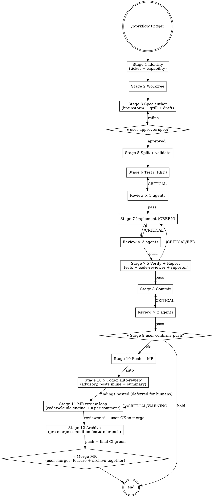

# workflow

End-to-end pipeline. The user sees three checkpoints: spec approval, pre-push, and OK-to-merge (Stage 11 → 12 handoff). Everything else runs automatically with multi-reviewer agents validating each stage.

**Core rule:** Every change is traceable to a spec. Prefer attaching to an **existing** capability (`## MODIFIED Requirements`) over creating a new one. Single `openspec/changes/{name}/spec.md` is the source; 5 derived files live in the same folder.

**Lifecycle rule:** Pipeline ends at **archive (Stage 12)**, not at push. Stage 10.5 (codex auto-review) runs immediately after push as an advisory layer; Stage 11 (MR review loop) re-enters after **human** MR comments arrive; Stage 12 runs **after reviewers approve and before final merge** — the archive commit is added to the same feature branch so feature + archive ship together in one MR. Don't treat push as "done".

**Reviewer rule:** Each automated review stage dispatches **2–3 parallel agents** with distinct personas (Agent tool, single message with multiple tool_use blocks per `superpowers:dispatching-parallel-agents`). Aggregate findings. Block on CRITICAL issues; surface WARNING/SUGGESTION to user but proceed. Review 迴圈受**收斂邊界**約束（見下方章節）：CRITICAL 只有四類、必附失敗情境、每 stage 最多初審 + 2 輪重派。

**Skip rule:** Trivial UI tweaks (color/spacing only, no behaviour change) MAY skip this pipeline and go straight to a `style:` / `chore:` commit. If unsure, run the pipeline.

**Fast mode:** For small scope (≤ 3 Scenarios in spec OR expected diff < 100 LoC), each reviewer stage drops to **1 combined reviewer** instead of 3/3/2 (saves ~2/3 tokens, ~135 k → ~45 k for Stage 6). Trigger:
- explicit: `/workflow --fast ...`
- auto-detect at end of Stage 5: count Scenarios in `specs/{name}/spec.md`; if ≤ 3, propose fast mode to user, confirm before continuing
- override: `--full` forces full mode regardless of scope

**Project bindings:** This orchestrator is **stack-agnostic**. It delegates stack/framework specifics to **project-local skills** under `<repo>/.claude/skills/<name>/SKILL.md` (auto-loaded by Claude Code when that repo is the working tree). The orchestrator invokes these by convention name; **each project provides its own implementation**:

| Convention name | Invoked at | Project provides |
| --- | --- | --- |
| `test-writer` | Stage 6 | How to author tests for this stack/framework |
| `rd-implementer` | Stage 7 | How to implement code layer-by-layer for this stack |
| `code-reviewer` | Stages 7.5, 11 | What "correct" means here (lint, layering, invariants) |
| `reporter` | Stages 7.5, 11 | Report format + coverage rules |
| `mr-reviewer` | Stage 10.5 | Stack-specific MR review dimensions |
| `review-fixer` | Stage 11 | How to resolve review findings per stack conventions |

Project-level config lives in `<repo>/AGENTS.md`. When this document refers to `{TEST_COMMAND}`, `{BUILD_COMMAND}`, `{LINT_COMMAND}`, `{LAYERING_CONVENTION}`, `{INTEGRATION_BRANCH}`, or `{TICKET_PREFIX}`, substitute from AGENTS.md (`{LINT_COMMAND}` 沒有就綁 no-op)。註：AGENTS.md template 的 Common Commands 用小寫 `{lint_command}` 等拼法 — 大小寫兩式指同一個 binding，orchestrator 端慣例大寫。

To bootstrap a project: run `scripts/init-project.sh <stack> <target-repo>` to scaffold the skill set from `templates/skills/<stack>/` (e.g. `android`). Hand-author new stacks by following any existing template.

## Process



## Stages

### Stage 1: Identify

1. Ask for **ticket ID** (Linear, Jira, GitHub Issues, etc.; or skip — personal/optimization work). **Normalize** to the full id `{TICKET_PREFIX}-<number>` using the AGENTS.md binding (a bare `3756` becomes e.g. `AIP-3756`) and record it as `{TICKET}` — downstream stages interpolate it verbatim
2. Ask for a one-line feature description (if not in trigger args)
3. Derive and record **both** (Stage 2 consumes them separately — never re-derive one from the other by string surgery):
   - `{feature-slug}` (kebab-case, no ticket parts; e.g. `fix-data-pinning`)
   - `{name}`: with ticket `<ticket-id-lowercase>-{feature-slug}` (e.g. `aip-3756-fix-data-pinning`); without ticket just `{feature-slug}`
4. List existing capabilities (**check both already-accumulated and in-progress**):
   - Archived: `ls openspec/specs/`
   - In-progress (not yet archived): `ls openspec/changes/*/specs/` — these capabilities exist on other branches but will appear in main spec tree after their respective MR merges (each MR bundles its own archive commit before merge, see Stage 12)
   - Show union to user. Ask:
     > "Does this attach to an existing capability (MODIFIED) or create a new one (ADDED)?"
   - **MODIFIED**: record target capability name; subsequent spec uses `## MODIFIED Requirements`
   - **ADDED**: new capability; will live at `openspec/specs/{name}/` after archive
   - **NOTE**: if you fork from `{INTEGRATION_BRANCH}` and it lags behind an in-progress capability merge, you may see "no capabilities" — that's expected; consult MEMORY.md or `openspec list` for what's in flight
5. **Existing-change check**: if `openspec/changes/{name}/` already exists:
   - Inspect contents. If `proposal.md + design.md + specs/*/spec.md + tasks.md` all present → spec is **already authored**
   - Ask user: "Spec already exists. Resume from which stage?"
     - `tests` (Stage 6) — most common
     - `implement` (Stage 7) — if tests already written
     - `commit` (Stage 8) — if code already done
     - `push` (Stage 10) — if commit already done
     - or: overwrite / suffix `-v2` / abort
   - On resume: skip Stages 3–5, jump to chosen stage

### Stage 2: Worktree

Branch behaviour depends on whether Stage 1 found an **existing** change or a **new** one. Per `worktree-before-new-spec` feedback, **new specs MUST get a fresh worktree**.

```bash
# {TICKET} = normalized full ticket id recorded at Stage 1 (e.g. AIP-3756, JIRA-42);
# {feature-slug} = recorded at Stage 1 (never re-derive it by stripping {name})
branch_name="${TICKET:+${TICKET}-}{feature-slug}"   # feat/AIP-3756-fix-data-pinning OR feat/fix-data-pinning
current_branch=$(git branch --show-current)
```

**Case A — new spec (Stage 1 had no existing change):**
MUST create a fresh linked worktree, **unless user explicitly says "skip worktree"**.

```bash
base="{INTEGRATION_BRANCH}"   # from AGENTS.md — if the binding is missing/unsubstituted, STOP and ask; never guess
if git show-ref --verify --quiet "refs/heads/${base}"; then
    :   # local branch exists
elif git show-ref --verify --quiet "refs/remotes/origin/${base}"; then
    base="origin/${base}"   # fresh clone: base off the remote-tracking ref
else
    echo "integration branch '${base}' not found locally or on origin" >&2   # STOP — ask the user, do NOT fall back to another branch
fi
git worktree add .worktrees/{name} -b "feat/${branch_name}" "$base"
cd .worktrees/{name}
```

Do NOT work in the main repo for new specs. Hard rule.

**Case B — resume of existing change (Stage 1 detected `openspec/changes/{name}/`):**
Use whatever is already set up:

```bash
if [ "$current_branch" = "feat/${branch_name}" ]; then
    : # already on right branch, work in place (main repo or linked worktree)
elif git worktree list | grep -q "feat/${branch_name}"; then
    # there's an existing linked worktree for this branch — cd into it
    cd "$(git worktree list --porcelain | awk -v b="refs/heads/feat/${branch_name}" '/^worktree/ {w=$2} $0==("branch " b) {print w}')"
else
    # branch exists but not currently checked out anywhere — create fresh worktree
    git worktree add .worktrees/{name} "feat/${branch_name}"
    cd .worktrees/{name}
fi
```

### Stage 3: Spec author

Inline (DO NOT invoke `superpowers:brainstorming` / `grill-me` as separate Skill tools):

1. **Brainstorm**: 1–2 clarifying questions if intent unclear; 1–3 approaches if multiple options. Settle direction.
2. **Ask: grill?** "Want to grill this design for holes before writing the spec?"
   - yes → 2–4 stress rounds inline; capture risks into Impact section
3. **Create the change folder first**: `mkdir -p openspec/changes/{name}/specs/{name}/`
4. **Scope audit** (mandatory before the spec claims any file / entry-point / call-site count):
   - Any "N files / N entry points / N call sites" claim must come from a **full-codebase grep**, never from an Explore subagent's sampled search (prior incident: sampling missed 6 entry points — feedback: spec-audit-full-callsites).
   - Grep **call sites, not imports**: match the call token itself, e.g. `grep -rnE '\bFoo\(' --include='*.kt'` (import matching misses wildcard imports and fully-qualified calls — feedback: grep-call-sites-not-imports).
5. **Draft `openspec/changes/{name}/spec.md`** using `references/single-spec-template.md`. Sections:
   - `# {Feature Name}`
   - `## Why`, `## What`, `## Impact`
   - `## Design` (optional)
   - `## Requirements` (Requirement → Scenario nested)
   - `## Tasks`

   This file is the **single source of truth** — the 5 OpenSpec files are derived from it (Stage 5). The user reads and edits **only** this file; downstream tools (validate / archive / reporter) read the derived 5.
6. Display draft.

### Stage 4: ⏸ User approves spec

User says approve / refine. Iterate.

### Stage 5: Split + validate

`openspec/changes/{name}/spec.md` is now approved. Project it into 5 derived files **in the same folder** per `references/file-mapping.md`:

```
openspec/changes/{name}/
├── spec.md                ← SoT (KEEP, do not delete)
├── .openspec.yaml         ← derived (metadata stub)
├── proposal.md            ← derived (Why + What + Impact)
├── design.md              ← derived (Design)
├── specs/{name}/spec.md   ← derived (Requirements with ADDED/MODIFIED prefix)
└── tasks.md               ← derived (Tasks)
```

**Do NOT delete `spec.md`.** It is the editable single source. If the user later changes scope or scenarios, you re-run the split (overwriting the 5 derived files).

Run `openspec validate {name}`. Fix any errors. If errors come from the derived files, the fix usually means amending `spec.md` and re-splitting — never edit the 5 derived files by hand.

### Stage 6: Tests / Verification

First **classify the spec type** by inspecting the Scenarios in `openspec/changes/{name}/specs/*/spec.md`:

| Spec type | Scenario fingerprints | Stage 6 mode |
|---|---|---|
| **behavioural** | mentions runtime entities (state holders, controllers, data sources, etc.) or `WHEN <user action>` / `WHEN <external system returns>` | **6a Unit-test mode** |
| **static-content** | `WHEN 檢視 <file>`, `THEN <file> NOT contains <pattern>`, `WHEN grep`, `WHEN find` | **6b Static-validation mode** |
| **manual-smoke** | mentions on-device or post-build artifact inspection (binary decompilation, install-and-verify, etc.) | **6c Manual-smoke mode** |

A spec may be **mixed** — fall through modes for the matching subset of Scenarios.

#### Mode 6a: Unit-test (most behavioural specs)

**Pre-RED**: tests cannot compile if production code doesn't exist. Two acceptable paths:

A. **Stub-first** (recommended): write a minimal production stub at the target file (function/class/module declared, body throws "not implemented" or returns a placeholder) so tests compile. Tests then run and fail with the placeholder's runtime error (true RED). Stage 7 fills the stubs.

B. **Compile-fail-as-RED**: skip stub, accept "compile error" as RED state. Document this explicitly to reviewers in the dispatch prompt. Less rigorous but faster.

Then dispatch **3 parallel reviewer agents** (or **1 combined** in fast mode):
- `review-test-coverage` — every behavioural Scenario covered
- `review-test-isolation` — mocks correct, no shared state
- `review-test-quality` — naming, assertions, project conventions

#### Mode 6b: Static-validation (config / build / resource files)

Write **assertion script** (`tests/static_validation.sh` or inline) that translates each Scenario into `grep` / `find` / `xmllint` / `jq` checks against the target file.

Example: Scenario "`<offending pattern>` removed from `<config-file>`" →
```bash
grep -q "<pattern>" <config-file> && \
  { echo "FAIL: pattern still present"; exit 1; } || \
  echo "PASS: pattern removed"
```

Stack-specific concrete examples live in the project-local `test-writer` skill (see **Project bindings**).

Confirm the script **fails as expected** with the current (pre-change) file (RED). Then dispatch **2 parallel reviewer agents** (simpler than 6a):
- `review-static-coverage` — every static Scenario has a corresponding check
- `review-static-correctness` — each check actually tests the right thing (not just a tautology)

#### Mode 6c: Manual-smoke (e.g., ProGuard, APK signing, screenshots)

You CANNOT write automated tests. Instead:
1. Extract the smoke matrix from `tasks.md` (e.g., "10-項 smoke 矩陣")
2. Write a **manual smoke checklist** at `openspec/changes/{name}/smoke-checklist.md` with each scenario, expected result, and a checkbox
3. **Skip Stage 6's automated reviewer dispatch entirely** — there's nothing automated to review yet
4. Surface to user: "This spec is manual-smoke type. After implementation (Stage 7), you'll need to run the smoke matrix manually."

CRITICAL → fix → re-dispatch (modes 6a/6b only). WARNING/SUGGESTION → surface, proceed.

### Stage 7: Implement (GREEN)

Invoke `rd-implementer` OR implement directly. Run tests until GREEN.

Dispatch **3 parallel reviewer agents** (Implement personas):
- `review-spec-compliance` — every SHALL / Scenario satisfied
- `review-code-quality` — project conventions, layering rules, error-handling and safety invariants (specifics defined by the project's `code-reviewer` skill; 專案 lint 工具鏈檢查的項目歸 Stage 7.5 lint gate — gate 前的風格觀察最高 SUGGESTION)
- `review-edge-cases` — error paths, boundaries, concurrent access, off-by-one

Aggregate. CRITICAL → fix → re-dispatch.

### Stage 7.5: Verify + Report

After Stage 7 reviewers PASS, before any commit. Mandated by MEMORY `feedback_auto_workflow_discipline` — auto/autonomous mode must NOT skip.

1. **Lint gate**: run `{LINT_COMMAND}`。紅 → 修正重跑，**最多 2 次修復嘗試**（複雜度門檻類規則沒有機械修法 — 2 次後仍紅進 user gate，不迴圈、不 drive-by refactor）。綠燈前不派任何 reviewer。綠燈後，**本專案 `{LINT_COMMAND}` 工具鏈實際檢查的項目**一律禁提。沒 linter 綁 no-op 的專案 = 沒有東西被工具驗過 → 風格類 finding 仍可提，但最高 SUGGESTION。
2. **Test gate**: run the project's `{TEST_COMMAND}` (from `<repo>/AGENTS.md`; scoped to changed modules if large repo). Must be green. RED → loop back to Stage 7.
3. **Verify**: invoke `code-reviewer` skill — spec ↔ code line-by-line. Must return **0 CRITICAL**（user 在觸頂 gate 裁決過的 `rejected`/`deferred` 不計）。CRITICAL → loop back to Stage 7.
4. **Report**: invoke `reporter` skill — write `openspec/changes/{name}/report.md` (Requirement × Scenario 覆蓋率 + 實作對照 + 問題清單).
5. Surface report summary inline; user sees coverage before commit.

**7.5 退回計數器**：step 2（test 紅）與 step 3（verify CRITICAL）**共用一個計數器，退回 Stage 7 最多 2 次**。退回後的 Stage 7 只做 fix，不開新 reviewer 輪、Stage 7 自己的重派額度**不重置**。計數器用完還是紅／還有 CRITICAL → 進收斂邊界的觸頂 user gate。

For **mode 6c (manual-smoke)** specs: skip the test gate (no automated tests); still run verify + report against the smoke checklist; user must complete smoke matrix before push (Stage 9).

### Stage 8: Commit

Compose conventional commit:
```
{type}({scope}): {description} [{TICKET_PREFIX}-XXXX if ticket]

{optional body}

Spec: openspec/changes/{name}/specs/{name}/spec.md
Scenarios: scenario-name-1, scenario-name-2
AI-assisted: yes
```

Dispatch **2 parallel reviewer agents** (Commit personas):
- `review-commit-message` — type/scope correct, footer complete, ticket ref present
- `review-changeset` — diff matches description (no scope creep, no stray files)

CRITICAL → fix → re-dispatch. Then `git commit`. (Projects may configure PreToolUse/PostToolUse hooks — e.g. guarding `{INTEGRATION_BRANCH}`/main, or a post-commit verify reminder. This repo ships none; never rely on a hook existing.)

### Stage 9: ⏸ User confirms push

Show: commit hash + subject, diff stats, branch name, target remote — 外加重派輪記成 `pending` 的 CRITICAL 級淨新 finding（按 cost 低到高排），已知的問題絕不靜默出貨。

Ask: "Push now, or hold?"

### Stage 10: Push + MR

```bash
git push origin "feat/${branch_name}"   # never push {INTEGRATION_BRANCH}/main directly
# GitHub:
gh pr create --base {INTEGRATION_BRANCH} --title "$(git log -1 --pretty=%s)" --body "..."
# GitLab:
glab mr create --target-branch {INTEGRATION_BRANCH} --title "$(git log -1 --pretty=%s)" --description "..."
```

MR description includes spec path + ticket link (from Stage 1's tracker — Linear, Jira, GitHub Issues, etc.). **After MR is created, immediately proceed to Stage 10.5** — do NOT jump straight to Stage 11.

### Stage 10.5: Codex auto-review (advisory, runs immediately after push)

**Why**: prior reviewer passes (Stages 6/7/8) reviewed the change against the spec; Stage 10.5 gives the MR-as-deliverable one final pass through the actual GitLab MR surface, using `codex:codex-rescue` to mimic a senior human reviewer. Findings appear as inline DiffNotes on the MR before humans look at it — sets baseline quality + saves human reviewer cycles.

**Mode**: **advisory** (does NOT block pipeline). If codex finds CRITICAL, you surface it in chat and ask the user whether to fix-and-amend (re-push) or close MR. Default: leave findings on the MR and proceed to Stage 11 deferred state.

#### 0. Engine detection (mirrors Stage 11 Step 0)

```bash
codex_available=false
if command -v codex >/dev/null 2>&1 \
   && [ -d "$HOME/.claude/plugins/marketplaces/openai-codex" ]; then
    codex_available=true
fi
```

- `codex_available=true` → dispatch `Agent(subagent_type="codex:codex-rescue", prompt=…)`
- `codex_available=false` → fallback `Agent(subagent_type="general-purpose")` + load `mr-reviewer` skill content into the prompt
- User override: `/workflow --skip-codex-review` or `/workflow --engine=claude`

#### 1. Pre-flight (in main shell, before dispatch)

The dispatcher (main Claude shell) MUST gather these and pass them into the codex prompt — codex sandbox cannot reach the GitLab API host:

```bash
glab mr view {MR_ID}                                          # title + state
glab mr diff {MR_ID}                                          # diff
glab api projects/<encoded>/merge_requests/{MR_ID} | jq '.diff_refs, .web_url'
# capture base_sha / head_sha / start_sha / gitlab_host / project_path_encoded
```

#### 2. Dispatch codex with explicit instructions

Use the prompt at `references/codex-mr-review-prompt-template.md` (see Templates section). Key clauses to include:

- Worktree path
- SHA refs
- Project path (URL-encoded)
- Files in scope (production code only; **skip** `openspec/changes/**/*.md`)
- "Set the bar HIGH — N prior reviewer passes already covered the obvious"
- "**DO NOT** post comments yourself — return findings as structured payload; dispatcher will post via main-shell glab/curl"

#### 3. Sandbox limitation — relay-post pattern

Codex sandbox network access to GitLab API host is typically blocked (`connect: operation not permitted`). The skill contract is:

| Step | Who | Action |
|---|---|---|
| Analysis | Codex | Read diff + files, classify CRITICAL/WARNING/SUGGESTION/SIMPLIFY |
| Findings emit | Codex | Return findings JSON or markdown back to dispatcher |
| DiffNote post | **Dispatcher** | `curl` each finding with PRIVATE-TOKEN + SHA position |
| Summary post | **Dispatcher** | `glab mr note {MR_ID}` with weighted score |

Do NOT let codex try `curl http://<gitlab_host>/...` — it will silently fail. Always relay.

#### 4. After posting

- 0 CRITICAL → log score in chat + proceed to Stage 11 deferred state. **No user checkpoint needed** (advisory mode).
- ≥1 CRITICAL → surface findings in chat with `⏸` prompt:
  - `fix` → user fixes locally; re-dispatch Stage 6.5/7.5 if needed; force-push (with explicit user consent per `no-force-push` memory) or new commit + push; re-run Stage 10.5 once
  - `accept` → leave MR open with codex CRITICAL visible; proceed to Stage 11 deferred (human reviewers will see codex findings too)
  - `close` → `glab mr close {MR_ID}`; pipeline ends at Stage 10.5

#### 5. Idempotency

Re-running Stage 10.5 on the same MR posts a **new** summary note + may duplicate inline comments. To avoid duplication, the dispatcher SHOULD `glab api projects/.../merge_requests/{MR_ID}/discussions` first, check if a discussion with `*🤖 Reviewed by Codex*` signature already exists, and skip / supersede if so. User can force re-review with `/workflow --re-review {MR_ID}`.

### Stage 11: MR review loop (deferred trigger)

Push 完 MR 後 reviewer 通常要數小時/數日。**不自動觸發** — user 重新進 pipeline 的方式：

```
/workflow --mr-loop {MR_ID}
/workflow --mr-loop {MR_URL}
```

Or pipeline 外直接調用 `mr-reviewer` / `review-fixer` skill。

#### 0. Fix engine detection (進 Stage 11 第一步)

預設用 **codex**，codex 不可用才 fallback 到 claude agent。

```bash
codex_available=false
if command -v codex >/dev/null 2>&1 \
   && [ -d "$HOME/.claude/plugins/marketplaces/openai-codex" ]; then
    codex_available=true
fi
```

| Engine | 觸發 | 派遣方式 |
|---|---|---|
| **codex** (default) | `codex_available=true` | `Agent(subagent_type="codex:codex-rescue", prompt=…)` — thin forwarder 經 `codex-companion.mjs task` 跑 codex CLI |
| **claude** (fallback) | codex 不可用 | `Agent(subagent_type="general-purpose")` + `review-fixer` skill |

整個 Stage 11 loop 用同一個 engine，不中途切換（一致性 + 方便事後判 fix 品質歸因）。User 可用 `/workflow --mr-loop {MR} --engine=claude` 強制覆寫。

**重要**：codex 不會自動套用 Claude Code skill。它只看 `<repo>/AGENTS.md` + `~/.codex/AGENTS.md` + 我們派遣時傳入的 prompt + repo files。要讓 codex 行為符合 review-fixer 規範，必須把規則**打包進 prompt**。完整 prompt template 見 `references/codex-prompt-template.md` — Step 2b (PLAN ONLY) 和 Step 2d (APPLY) 各一個範本。

#### 1. Fetch + Classify

- Fetch：`mr-reviewer` skill 或 `glab api projects/:id/merge_requests/{MR_ID}/discussions`，取所有 unresolved discussions（含 inline + general）。
- Classify by severity（CRITICAL / WARNING / SUGGESTION）。
- SUGGESTION 列給 user 一次看完，user 決定整批吸收/略過，不進 per-comment loop。
- CRITICAL / WARNING → 進步驟 2 per-comment checkpoint loop。

#### 2. Per-comment checkpoint loop (✋ 每個 comment 強制 user approve)

**對 CRITICAL / WARNING 每一條 comment 重複以下子流程**：

| Step | 動作 | 誰做 |
|---|---|---|
| 2a | **Show comment**：檔案+行號、reviewer 原文、severity、相關 spec scenario | Claude |
| 2b | **Engine 產 fix plan**（純自然語言計畫，**不寫 code**）：要動哪些檔、改什麼、為何 | engine |
| 2c | **⏸ User decision** | user |
| 2d | **Apply fix** 依 approved plan 改 code | engine |
| 2e | **⏸ User verify**：show diff + 該 comment 範圍內 unit test 結果 | user |
| 2f | **Auto-resolve discussion**：`glab api ... resolve` + reply 引用 commit hash + 一行 fix summary | Claude |
| 2g | 下一個 comment | — |

**Step 2c user options**：

| 選項 | 行為 |
|---|---|
| `approve` | 進 2d，engine 動手改 |
| `modify <text>` | user 改 fix plan，回 2b 重新給計畫 |
| `skip` | 留 unresolved（reviewer 自己取捨），跳下一條 |
| `defer` | 標記 deferred，全 loop 結束後再回頭問 user |
| `abort` | 中止 Stage 11，剩餘 comments 不處理 |

**Step 2e user options**：

| 選項 | 行為 |
|---|---|
| `ok` | 進 2f auto-resolve |
| `redo <hint>` | 回 2b 重出計畫 |
| `revert` | `git checkout -- <files>` 把本條 fix 還原，標 deferred |

**禁止**：批次處理多個 comment 後一次給 user 看 — 違反 per-comment checkpoint 設計初衷（user 要逐條判 fix 品質，避免 engine 在某條偏離後續條跟著歪）。

#### 3. After all comments processed

- Re-run **Stage 7.5** (test + verify + report) 一次，確認整體沒回歸。RED/CRITICAL → 列出來給 user 決定處理哪些。
- 處理 deferred 標記的 comments（若有）：回到步驟 2 per-comment loop。

#### 4. Push update

`git push`。預設**一條 comment 一個 commit**（per-comment commit），方便 reviewer 對照 + 必要時 revert 單條。User 可指定 `--squash` 合併。

#### 5. Detect ready-to-merge

全部 CRITICAL/WARNING resolved（approve / skip / defer 後收斂）+ 無 deferred 殘留 + reviewer ✅ + **user 明確說 OK merge** → 交棒 Stage 12。**此時不 merge** — merge 發生在 Stage 12 的 archive commit push、最後一輪 CI 綠之後。

交棒前**必跑** sanity poll：`gh pr view --json state` / `glab mr view --output json | jq .state` 確認 MR 仍是 open（沒被提早 merge 或 close）。若發現已被提早 merge（spec 未 archive 就進了整合分支）→ 走 Stage 12 的「提早 merge 補救」。

#### Loop 結束條件

- Ready-to-merge（如上）→ Stage 12
- User `abort` → 退出，MR 保持 open，已 apply 的 fix 已 push

#### 與 Stage 7.5 的差別

| | Stage 7.5 | Stage 11 |
|---|---|---|
| 觸發 | commit 前自動 | MR 收到 comments 後 deferred |
| 來源 | spec | reviewer comments |
| 動作 | code-reviewer + reporter + tests | codex/claude engine + auto-resolve |
| 人工介入 | 零（auto pass/fail） | **每條 comment 兩個 ✋**（approve plan + verify diff）|
| 結束 | 0 CRITICAL → commit | 全部 resolved + reviewer ✅ + user OK merge → archive（再 merge）|

### Stage 12: Archive (pre-merge, on feature branch)

進入條件：Stage 11 loop 全收斂（0 CRITICAL、所有 comment resolved、reviewer ✅）+ user 明確同意要 merge。**不要按 merge**，先在 feature branch 加 archive commit，讓 feature + archive 一起 merge。

1. 在 feature worktree / branch 跑 `openspec archive {name} --yes`（或 `scripts/archive.sh {name}`）。CLI 會：
   - 把 `openspec/changes/{name}/` 搬到 `openspec/changes/archive/YYYY-MM-DD-{name}/`
   - Promote delta spec 進 `openspec/specs/{capability}/spec.md`（ADDED → 新檔 / MODIFIED → 合 delta）
   - 跑 `openspec validate`
2. **手動補 CLI 不做的事**：
   - canonical spec 的 `## Purpose`（CLI promote 出 `TBD - created by archiving ...`，必填，不然下次 reviewer 看會以為沒寫完）
   - `openspec/specs/MISSING.md` count + capability 分組
3. Commit 在 feature branch 上：
   ```
   chore(openspec): archive {name}
   ```
   Footer 帶 spec / scenarios / AI-assisted 標記（照各 project commit convention）；Spec 路徑指 archive **後**的位置（`openspec/changes/archive/YYYY-MM-DD-{name}/...` — 這個 commit 自己就把舊路徑刪了）。
4. Push 到原 feature MR。CI 最後再跑一輪。
5. 綠燈後回報 user，**由 user 親手 merge MR**（orchestrator 一律不代按 merge）。feature + archive 一次進整合分支。

**為什麼 pre-merge bundle 而不是另開 MR / CI auto-archive**：archive 是純機械動作（folder move + spec merge），另開一個 doc-only MR 等於再跑一整輪 lint + test + deploy preview，純粹浪費 CI 額度與 reviewer 注意力。Bundle 進 feature MR 的最後一個 commit，整個生命週期只多一輪 CI，省一輪完整 MR pipeline。

**Safety**：仍然不可在 review 進行中就 archive — 視窗是「所有 reviewer ✅ → user 確認 OK merge → archive commit → 最後一輪 CI → merge」。archive commit 之前 spec 都在 `openspec/changes/` 裡讓 reviewer 引用。

**Archive 之後、merge 之前的窗口**：archive push 是一個新 commit，多數 GitLab/GitHub 設定會因此 **reset 已給的 approval**；reviewer 也可能在這段窗口留新 comment。處理規則：
- 有新 comment → 重進 Stage 11 per-comment loop；prompt 裡的 spec 路徑改用 archive 後位置 `openspec/changes/archive/YYYY-MM-DD-{name}/specs/{name}/spec.md`。
- Approval 被 reset → 修完（或無需修）後提醒 reviewer 重新 approve，再回到「user OK merge」。
- 不要為了躲 approval reset 而把 archive 移回 merge 後 — 那就退化回舊制了；多一次 approve 點擊是這個設計的已知成本。

**User-side cleanup after merge**：

- `git worktree remove .worktrees/{name}` + `git branch -D feat/{branch_name}`（squash-merge 後 commit hash 對不上，要 `-D` 強刪）
- 關 ticket + 從 MEMORY active list 移除

**Fallback / 變體**：
- 若 archive commit push 後 CI 紅（如 `openspec validate` fail），在 feature branch 上 fix，再 push 一次。MR 最後一輪 CI 必須綠。
- **提早 merge 補救**：若 user 在 archive 之前就按了 merge（spec 未 archive 進了整合分支），在整合分支上開一個 `chore(openspec): archive {name}` 的小 MR 補跑 `openspec archive` — 這是唯一允許為 archive 另開 MR 的情況。
- 若 project 仍有舊的 GitHub `.github/workflows/auto-archive.yml`，**一律建議刪除**：它是用 PR 的路徑 diff 偵測 change，不是看 tree 現況 — 一般情況下確實 no-op，但遷移期（base 上殘留舊制未 archive 的 folder 被本 MR 順手 bundle 掉）會誤觸發而紅燈，極端情況（stale base.sha 夾帶到別人 merge 進 base 的 change 路徑）甚至會 archive 掉別人 in-flight 的 change 並 bot-push 整合分支。

## Reviewer dispatch pattern

When a stage says "dispatch N parallel reviewer agents":
1. Compose **one message** with N Agent tool calls (single-message multi-tool-use)
2. Each agent gets the same artifact (test files / diff / commit) + persona-specific prompt
3. **In fast mode** (`--fast` flag or auto-detected small scope), N drops to **1**: use a single combined-persona prompt that merges the N persona checklists. Saves ~2/3 tokens.
4. Wait for all N to complete; capture per-agent token usage from Agent tool result
5. Aggregate by severity: CRITICAL (block) > WARNING (surface) > SUGGESTION (note)
6. **De-duplicate**: when two reviewers raise effectively the same item (same file:line, same intent), merge into one entry and tag which reviewers flagged it. 合併後 `cost:` 不一致 → 取最高。Sort SUGGESTIONs by ROI (impact / 該條的 `cost:` 欄), highest first.
7. If CRITICAL → fix → re-dispatch the same reviewers (same prompts, post-fix artifact) — 受收斂邊界約束：每 stage 初審 + 最多 2 輪重派，重派只驗「舊 CRITICAL 解了沒 + fix diff」（見下方「收斂邊界」）
8. **After PASS**, append the aggregated summary to `openspec/changes/{name}/review.md` under a stage heading. Do NOT store individual agent raw reports.
9. **Disposition write-back**: every finding line — CRITICAL, WARNING, and SUGGESTION alike — ends with `— disposition: fixed | rejected | deferred | pending`（em-dash `—` 分隔，tag 一律排在行尾；`deferred` 的 ticket 括號跟在 tag 後：`— disposition: deferred ({TICKET_PREFIX}-XXXX)`，缺 ticket 的 deferral 歷史上永遠不會被關）。New WARNING/SUGGESTION entries start `pending`; CRITICALs are logged `fixed` once the fix → re-dispatch loop clears them. Whichever later stage (or the user) acts on or dismisses a finding updates the tag **in place** — the only in-place edit allowed in the append-only log，**且此規則延伸到 archive 之後**：更新 archived change 裡 `review.md` 的 disposition tag 是唯一允許的 post-archive 編輯（只改 tag，不改內容；spec 本體仍然 NEVER 動）。Purpose: reviewer yield becomes greppable (flagged vs. adopted), so low-yield personas get pruned with data instead of faith.

### review.md format

```markdown
# Review log: {Feature Name}

## Stage 6 Tests (YYYY-MM-DD)
- **Mode**: {6a/6b/6c}, {full/fast}
- **Reviewers**: review-test-coverage / review-test-isolation / review-test-quality
- **Iterations**: {N}  (how many CRITICAL → fix → re-dispatch rounds)
- **Token usage**: ~{total} k total ({split per reviewer}); parallel wall time ~{seconds} s

### CRITICAL
1. {short} — failure: {觸發情境/引用條文一行摘要} — flagged by: {reviewer names} — cost: {low|med|high} — disposition: fixed
_(none if empty)_

### WARNING
1. {short} — flagged by: {reviewer names} — cost: {low|med|high} — disposition: pending
_(none if empty)_

### SUGGESTION
(de-duplicated, sorted by ROI)
1. {short} — flagged by: {reviewer names} — cost: {low|med|high} — disposition: pending
2. ...

### Pass
- ...

### Verdict
**PASS** / **BLOCK**
```

One file, append-only, one section per stage — the sole exception is the `disposition:` tag, which is updated in place when a finding is later acted on or dismissed (including inside an already-archived change, see dispatch rule 9). Token usage + disposition tracked for retrospect: `grep -oE 'disposition: [a-z]+' review.md | sort | uniq -c` gives per-change reviewer yield.

## 收斂邊界（convergence boundary）

Review 迴圈必須收斂。目標對齊四件事：**程式碼正確、測試正確、行為正確、資安合規** — 除此之外的東西不配 block。邊界分兩半：嚴重度紀律（什麼能進迴圈）+ 迴圈保險絲（迴圈能跑多久）。

### 分層原則

整潔與無錯誤依三層擠出，**綁定工具鏈實際驗過的，AI reviewer 不准再提**：

1. **確定性工具**（`{LINT_COMMAND}`、formatter、靜態分析、編譯期約束）— 永不 loop，Stage 7.5 入口先跑。
2. **Spec 衍生測試** — 「無錯誤」的操作型定義 = 每條 Scenario 有測試、全綠、覆蓋達標。bug 沒被測試抓到 → finding 是測試缺口（補測試），不只是修 code。
3. **AI review** — 只剩工具驗不了的：spec 一致性、邏輯錯誤、測試假綠。只有這層需要以下邊界。

### 嚴重度紀律 — CRITICAL 只有四類

1. **程式碼正確性** — 實際產生錯誤結果或 crash 的 bug，且說得出觸發情境
2. **測試正確性** — 測試沒測到 Scenario、或測試本身錯（假綠/假紅）
3. **行為正確性** — 與 spec Scenario 明文衝突
4. **資安基準** — 違反專案 AGENTS.md「Security Baseline」段落的條文

**合法引用來源**（CRITICAL 可以錨定什麼）：
- spec Scenario（指名）
- Security Baseline 條文（指編號）。專案 AGENTS.md **沒有** Security Baseline 段落時，fallback 引用 `templates/project-AGENTS.md.template` 的 10 條預設，並把「缺段落」本身記一條 WARNING — 段落不存在絕不能讓真的資安 finding 被降級
- **專案鐵則** — 專案 CLAUDE.md 鐵則 / 架構文件裡可引述的條文。project-local reviewer skill 就是靠這條合法擴充四類：鐵則 CRITICAL 引條文即通過降級檢查
- **僅限 commit stage persona**（`review-commit-message` / `review-changeset`）：commit 契約本身（缺 spec footer、scope 不符、staged secrets）— 屬流程正確性，豁免四類檢定，引契約條目即可

每條 finding 過三問：**(1)** 是四類之一（或上列合法引用）嗎？不是 → 最高 WARNING（命名、風格、品味、引不出鐵則條文的架構偏好、無具體觸發情境的假設性邊界、效能微調一律不 block）。**(2)** 說得出具體失敗情境嗎？正確性必填「**具體的**輸入/狀態 → **具體的**錯誤結果」、行為必引 Scenario、資安/鐵則必引條文 — 說不出就不是 CRITICAL。**(3)** 修正代價？每條附 `— cost: low | med | high`（low = 局部、分鐘級；med = 單模組、小時級；high = 跨模組或設計變更），高代價低效益 → reviewer 自行降級或不提。cost 有下游消費者：觸頂 gate 與 Stage 9 清單按 cost 低到高排序、SUGGESTION 的 ROI 排序 = impact / cost。

**機械降級**：聚合時 CRITICAL 符合任一條即降 WARNING — `failure:` 欄缺失；欄位沒寫出具體輸入/狀態與具體錯誤結果（「bad input → wrong result」這種空泛填法不算）；引用**解析不到**（指名的 Scenario 不在 spec 裡、引的條文編號不在 AGENTS.md／鐵則文件裡）。不辯論。Lint 綠燈後，**本專案 `{LINT_COMMAND}` 工具鏈實際檢查過的項目**一律禁提（沒綁 linter = 沒東西被驗過 → 風格類仍可提，最高 SUGGESTION）。

### 迴圈保險絲

適用每個 stage 的 CRITICAL → fix → 重派迴圈（Stage 6/7/8）及 Stage 7.5 → 7 迴圈：

- **輪數上限**：初審 + 最多 **2 輪重派**（每 stage 共 3 次 review）。計數器只在「帶著新 artifact 重新進入該 stage」時重置，絕不在迴圈中途重置；7.5 退回**不會**幫 Stage 7 補血（見 Stage 7.5 的退回計數器）。
- **重派範圍**：重派輪只驗 (a) 舊 CRITICAL 解了沒、(b) fix diff 有沒有引入新問題。**fix diff 本身的新 CRITICAL 照常 block、照常消耗下一輪**。fix 沒碰到的 code 挖出的淨新 finding → 記進 review.md 標 `pending`，不 block、不觸發下輪（CRITICAL 級的 pending 會在 Stage 9 gate 列給 user 看，絕不靜默出貨）。
- **修過又出現（flip-flop）立停**：同一條 finding（同檔案、同 intent）修過又出現 → 不等觸頂，立即停 — 這是 fix A 壞 B 的訊號。**接手方式：進與觸頂相同的 user gate**。
- **觸頂 gate**：輪數用完還有 CRITICAL → 停止自動迴圈，殘留 findings（按 cost 低到高排）開 user gate 逐條裁決：人工修 / 接受續行（disposition 記 `rejected` 或 `deferred (ticket)`）/ abort。絕不 silent-pass。裁決過的 finding 不再計入任何 0-CRITICAL gate。
- **Fix 最小範圍**：修 CRITICAL 只修那條，禁 drive-by refactor（Stage 11 規則延伸到全 stage）— fix 不准變成下一輪的火源。

**Fast mode**：單一合併 reviewer 時，severity rubric 照樣前置到合併 prompt、機械降級照樣在出 verdict 前跑 — 一個 reviewer 不等於跳過聚合。

**天然豁免，不加儀式**：Stage 10.5 純 advisory 不 block（無 loop 可圍）；Stage 11 每條 comment 有兩個人工 ✋（天然有界），其一次性的 7.5 重跑遇 RED/CRITICAL 是列給 user 決定、不自動退回。豁免 stage 沿用各自 skill 的 severity 定義（如 MR review 計分制），四類規則不改寫它們。

> 命名註記：本節的「收斂邊界」與 iOS templates 的「**驗證邊界**」（測試資料衛生表，對映 Security Baseline rule 10）是兩個不同概念，勿混用。

## Resuming mid-pipeline

```
/workflow --from {stage} --spec {name}
```

`{stage}` ∈ `tests`, `implement`, `commit`, `push`, `review`, `archive`. Skip Stages 1–4, jump to specified stage. Reuses existing `openspec/changes/{name}/`.

- `review` resumes at Stage 10.5 against an already-pushed MR. Equivalent to `/workflow --re-review {MR_ID}` if the MR ID is known.
- `archive` resumes at Stage 12（session 在「OK-to-merge 之後、merge 之前」斷掉時用）。注意 archive commit 已存在時 `openspec/changes/{name}/` 已消失 — 以 `openspec/changes/archive/*-{name}/` 是否存在判斷是要補跑 archive、還是只剩「等 CI 綠 → user merge」。

## Quick Reference

| Stage | Action | Reviewers |
|---|---|---|
| 1 Identify | ticket + capability + name | — |
| 2 Worktree | branch `feat/[{TICKET}-]{feature-slug}` | — |
| 3 Spec | brainstorm + grill + draft | — |
| 4 ⏸ | user approves spec | — |
| 5 Split | 5 files + validate | — |
| 6 Tests | RED | 3 agents |
| 7 Implement | GREEN | 3 agents |
| 7.5 Verify+Report | `{LINT_COMMAND}` → tests + code-reviewer + reporter | — |
| 8 Commit | conventional + footer | 2 agents |
| 9 ⏸ | user confirms push | — |
| 10 Push | push + MR | — |
| 10.5 Codex review | dispatch codex → relay-post inline + summary | advisory, auto after Stage 10 |
| 11 MR loop | codex/claude engine + ⏸ per-comment (plan + verify) + auto-resolve | deferred + ✋ × 2 per comment |
| 12 Archive | `openspec archive {name}` commit 在 feature branch + 本機 worktree cleanup | pre-merge, same MR |

## Common Mistakes

| Mistake | Fix |
|---|---|
| Invoking brainstorming/grill-me as separate skills | Borrow principles inline, never call Skill tool |
| Creating new capability when an existing one fits | Stage 1: always offer MODIFIED first |
| Working in main repo on a new spec | Case A is mandatory: fresh worktree (per `worktree-before-new-spec`) |
| Overwriting existing change instead of resuming | Stage 1 must detect existing, offer resume stage |
| Forcing unit tests on a build-config-only spec | Use 6b (static-validation) or 6c (manual-smoke), not 6a |
| Skipping reviewer agents for "fast" stages | NEVER skip — multi-reviewer is the contract (modes 6a/6b only) |
| Dispatching reviewers sequentially | Single message, N Agent tool calls = parallel |
| 風格/品味類 issue 標成 CRITICAL | CRITICAL 只有四類（程式碼/測試/行為正確性、資安基準），必附失敗情境或引用條文；缺欄位聚合時機械降級 |
| 重派輪在 fix 沒碰的 code 挖新 finding | 重派只驗「舊 CRITICAL + fix diff」；淨新 finding 記 `pending`，不 block 不觸發下輪 |
| 迴圈跑超過上限 | 每 stage 初審 + 最多 2 輪重派；觸頂 → user gate 裁決；修過又出現（flip-flop）→ 立即停、進同一個 gate |
| Lint 綠了 reviewer 還嫌風格 | Stage 7.5 lint gate 綠燈後，**綁定 `{LINT_COMMAND}` 工具鏈實際檢查的項目**禁提（沒綁 linter → 風格類可提，最高 SUGGESTION） |
| Treating WARNING/SUGGESTION as blocker | Only CRITICAL blocks |
| Heavy spec for trivial colour change | Acceptable to bypass with `style:` commit |
| Editing archived spec | NEVER — propose a new MODIFIED change |
| Editing the 5 derived files by hand | NEVER — edit `spec.md` then re-split. Derived files are projections, not sources. |
| Storing 8 individual reviewer reports as files | NEVER — only append aggregated summary to `review.md` |
| Findings logged, disposition never updated | WARNING/SUGGESTION left `pending` forever make yield stats useless. Update `disposition:` in place the moment a finding is fixed or rejected. |
| Skipping Stage 7.5 in auto mode | Violates `feedback_auto_workflow_discipline`; commit blocked until 0 CRITICAL（user 裁決過的 `rejected`/`deferred` 不計）+ green tests + report generated |
| Running `code-reviewer` / `reporter` inside Stage 7 reviewers | Those agents are spec-vs-implementation gates; keep them in 7.5 so reviewer roles stay distinct (Stage 7 = peer review, Stage 7.5 = compliance gate) |
| Treating push as the end of pipeline | Pipeline ends at Stage 12 archive. Push only ships a candidate; review loop (Stage 11) closes the contract. |
| 為 archive 另開一個 MR | 不必。bundle 進原 feature MR 的最後一個 commit（reviewer ✅ + user OK merge 之後再加），省一整輪 MR + CI。 |
| Reviewer 還在 review 就 archive | 視窗是「reviewer ✅ + user OK merge」之後才動；提早 archive 會讓 spec 從 `openspec/changes/` 搬走、reviewer 找不到引用點。 |
| Archive 前就按了 merge | Stage 11 Step 5 的 sanity poll 必跑（確認 MR 仍 open）；真發生了 → 整合分支開 `chore(openspec): archive {name}` 小 MR 補跑（Stage 12 提早 merge 補救）。 |
| Agent 代按 merge | NEVER — CI 綠後回報，merge 一律 user 親手執行。 |
| Archive 後忘了本機清理 worktree | merge 後 `git worktree remove .worktrees/{name}` + `git branch -D feat/{name}` 要在本機自己跑（squash-merge branch 用 `-D` 強刪）。 |
| Batching MR comments and asking user once | Stage 11 mandates per-comment checkpoint (plan ✋ + verify ✋). Batching defeats the "user catches engine drift early" design. |
| Skipping Stage 11 Step 0 engine detection | codex CLI absence + still dispatching `codex:codex-rescue` agent → silent failure. Detect once at loop entry; cache `codex_available` flag. |
| Switching fix engine mid-loop | Stay on the engine chosen at Step 0. Mid-loop swap breaks "fix quality歸因 by engine" + may double-apply or miss commits. |
| Using engine to write code at Step 2b | Step 2b is **plan only**, no code. User approves the plan before any file changes. Engine writing code at 2b violates checkpoint contract. |
| Skipping Stage 10.5 codex review after push | Pipeline contract: every push triggers codex advisory pass. Skipping leaves the MR un-reviewed until humans look at it (could be hours). User override is `--skip-codex-review`. |
| Acting as Codex yourself (Claude doing the review) | The skill name is "Codex 扮演..."; dispatch via `Agent(subagent_type="codex:codex-rescue")` to use the real codex CLI. Claude self-roleplay defeats the multi-engine quality goal. |
| Letting codex curl GitLab directly from sandbox | Codex sandbox typically blocks the GitLab API host (`connect: operation not permitted`). Codex emits findings; **dispatcher** posts via main-shell glab/curl. |

## Templates

- `references/single-spec-template.md` — the spec.md user authors
- `references/file-mapping.md` — split rules to 5 OpenSpec files
- `references/reviewer-prompts.md` — persona prompts for parallel agents
- `references/codex-prompt-template.md` — Stage 11 prompt for `codex:codex-rescue` (PLAN ONLY + APPLY variants)
- `references/codex-mr-review-prompt-template.md` — Stage 10.5 prompt for codex auto-review (read MR diff → emit findings → dispatcher relays to GitLab)

## Related

- `superpowers:dispatching-parallel-agents` — technique used for multi-reviewer
- `superpowers:brainstorming` — principles borrowed inline, NOT invoked
- `superpowers:grill-me` — principles borrowed inline, NOT invoked
- `test-writer`, `rd-implementer`, `code-reviewer`, `reporter`, `review-fixer` — **project-local** skills (auto-loaded from `<repo>/.claude/skills/<name>/`), invoked at relevant stages; see **Project bindings** for the contract
- `mr-reviewer` — **project-local** skill invoked at Stage 10.5 (real codex via codex-rescue agent, not Claude self-roleplay)
- `codex:codex-rescue` — the codex CLI forwarder used by Stages 10.5 + 11
- `/opsx:propose` — alternative entry without pipeline
- `openspec archive {name} --yes` — CLI that does the folder move + spec promote + validate; run on feature branch before final merge. **Preferred.**
- `scripts/archive.sh` — standalone fallback for projects without the openspec CLI. NOT equivalent: it does not run `openspec validate`, and its MODIFIED path only appends a marked block instead of a real delta merge — prefer the CLI whenever available.
- `.github/workflows/auto-archive.yml` — legacy post-merge CI auto-archive; superseded by pre-merge bundle. **Delete it** — its path-diff detection can misfire during migration (see Stage 12 Fallback / 變體).
