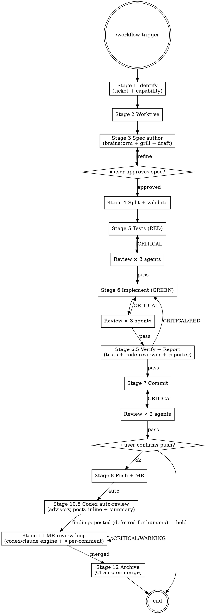

# workflow

End-to-end pipeline. The user sees two checkpoints: spec approval, and pre-push. Everything else runs automatically with multi-reviewer agents validating each stage.

**Core rule:** Every change is traceable to a spec. Prefer attaching to an **existing** capability (`## MODIFIED Requirements`) over creating a new one. Single `openspec/changes/{name}/spec.md` is the source; 5 derived files live in the same folder.

**Lifecycle rule:** Pipeline ends at **archive (Stage 12)**, not at push. Stage 10.5 (codex auto-review) runs immediately after push as an advisory layer; Stage 11 (MR review loop) re-enters after **human** MR comments arrive; Stage 12 runs after the MR is merged. Don't treat push as "done".

**Reviewer rule:** Each automated review stage dispatches **2–3 parallel agents** with distinct personas (Agent tool, single message with multiple tool_use blocks per `superpowers:dispatching-parallel-agents`). Aggregate findings. Block on CRITICAL issues; surface WARNING/SUGGESTION to user but proceed.

**Skip rule:** Trivial UI tweaks (color/spacing only, no behaviour change) MAY skip this pipeline and go straight to a `style:` / `chore:` commit. If unsure, run the pipeline.

**Fast mode:** For small scope (≤ 3 Scenarios in spec OR expected diff < 100 LoC), each reviewer stage drops to **1 combined reviewer** instead of 3/3/2 (saves ~2/3 tokens, ~135 k → ~45 k for Stage 6). Trigger:
- explicit: `/workflow --fast ...`
- auto-detect at end of Stage 5: count Scenarios in `specs/{name}/spec.md`; if ≤ 3, propose fast mode to user, confirm before continuing
- override: `--full` forces full mode regardless of scope

**Project bindings:** This orchestrator is **stack-agnostic**. It delegates stack/framework specifics to **project-local skills** under `<repo>/.claude/skills/<name>/SKILL.md` (auto-loaded by Claude Code when that repo is the working tree). The orchestrator invokes these by convention name; **each project provides its own implementation**:

| Convention name | Invoked at | Project provides |
| --- | --- | --- |
| `test-writer` | Stage 6 | How to author tests for this stack/framework |
| `rd-implementer` | Stage 7 | How to implement code layer-by-layer for this stack |
| `code-reviewer` | Stages 7.5, 11 | What "correct" means here (lint, layering, invariants) |
| `reporter` | Stages 7.5, 11 | Report format + coverage rules |
| `mr-reviewer` | Stage 10.5 | Stack-specific MR review dimensions |
| `review-fixer` | Stage 11 | How to resolve review findings per stack conventions |

Project-level config lives in `<repo>/AGENTS.md`. When this document refers to `{TEST_COMMAND}`, `{BUILD_COMMAND}`, or `{LAYERING_CONVENTION}`, substitute from AGENTS.md.

To bootstrap a project: run `scripts/init-project.sh <stack> <target-repo>` to scaffold the skill set from `templates/skills/<stack>/` (e.g. `android`). Hand-author new stacks by following any existing template.

## Process



## Stages

### Stage 1: Identify

1. Ask for **ticket ID** (Linear, Jira, GitHub Issues, etc.; or skip — personal/optimization work)
2. Ask for a one-line feature description (if not in trigger args)
3. Derive `{name}` (kebab-case):
   - With ticket: `<ticket-id-lowercase>-<feature-slug>` (e.g. `aip-3756-fix-data-pinning`)
   - Without ticket: `<feature-slug>` (e.g. `error-message-cleanup`)
4. List existing capabilities (**check both already-accumulated and in-progress**):
   - Archived: `ls openspec/specs/`
   - In-progress (not yet archived): `ls openspec/changes/*/specs/` — these capabilities exist on other branches but will appear in main spec tree after their respective MR merges (CI auto-archives)
   - Show union to user. Ask:
     > "Does this attach to an existing capability (MODIFIED) or create a new one (ADDED)?"
   - **MODIFIED**: record target capability name; subsequent spec uses `## MODIFIED Requirements`
   - **ADDED**: new capability; will live at `openspec/specs/{name}/` after archive
   - **NOTE**: if you fork from `developer` and `developer` lags behind an in-progress capability merge, you may see "no capabilities" — that's expected; consult MEMORY.md or `openspec list` for what's in flight
5. **Existing-change check**: if `openspec/changes/{name}/` already exists:
   - Inspect contents. If `proposal.md + design.md + specs/*/spec.md + tasks.md` all present → spec is **already authored**
   - Ask user: "Spec already exists. Resume from which stage?"
     - `tests` (Stage 6) — most common
     - `implement` (Stage 7) — if tests already written
     - `commit` (Stage 8) — if code already done
     - `push` (Stage 10) — if commit already done
     - or: overwrite / suffix `-v2` / abort
   - On resume: skip Stages 3–5, jump to chosen stage

### Stage 2: Worktree

Branch behaviour depends on whether Stage 1 found an **existing** change or a **new** one. Per `worktree-before-new-spec` feedback, **new specs MUST get a fresh worktree**.

```bash
branch_name="${TICKET:+AIP-${TICKET#AIP-}-}{name}"   # feat/AIP-3756-foo OR feat/foo
current_branch=$(git branch --show-current)
```

**Case A — new spec (Stage 1 had no existing change):**
MUST create a fresh linked worktree, **unless user explicitly says "skip worktree"**.

```bash
base=$(git show-ref --verify --quiet refs/heads/developer && echo developer || echo main)
git worktree add .worktrees/{name} -b "feat/${branch_name}" "$base"
cd .worktrees/{name}
```

Do NOT work in the main repo for new specs. Hard rule.

**Case B — resume of existing change (Stage 1 detected `openspec/changes/{name}/`):**
Use whatever is already set up:

```bash
if [ "$current_branch" = "feat/${branch_name}" ]; then
    : # already on right branch, work in place (main repo or linked worktree)
elif git worktree list | grep -q "feat/${branch_name}"; then
    # there's an existing linked worktree for this branch — cd into it
    cd "$(git worktree list --porcelain | awk -v b="refs/heads/feat/${branch_name}" '/^worktree/ {w=$2} $0==("branch " b) {print w}')"
else
    # branch exists but not currently checked out anywhere — create fresh worktree
    git worktree add .worktrees/{name} "feat/${branch_name}"
    cd .worktrees/{name}
fi
```

### Stage 3: Spec author

Inline (DO NOT invoke `superpowers:brainstorming` / `grill-me` as separate Skill tools):

1. **Brainstorm**: 1–2 clarifying questions if intent unclear; 1–3 approaches if multiple options. Settle direction.
2. **Ask: grill?** "Want to grill this design for holes before writing the spec?"
   - yes → 2–4 stress rounds inline; capture risks into Impact section
3. **Create the change folder first**: `mkdir -p openspec/changes/{name}/specs/{name}/`
4. **Draft `openspec/changes/{name}/spec.md`** using `references/single-spec-template.md`. Sections:
   - `# {Feature Name}`
   - `## Why`, `## What`, `## Impact`
   - `## Design` (optional)
   - `## Requirements` (Requirement → Scenario nested)
   - `## Tasks`

   This file is the **single source of truth** — the 5 OpenSpec files are derived from it (Stage 5). The user reads and edits **only** this file; downstream tools (validate / archive / reporter) read the derived 5.
5. Display draft.

### Stage 4: ⏸ User approves spec

User says approve / refine. Iterate.

### Stage 5: Split + validate

`openspec/changes/{name}/spec.md` is now approved. Project it into 5 derived files **in the same folder** per `references/file-mapping.md`:

```
openspec/changes/{name}/
├── spec.md                ← SoT (KEEP, do not delete)
├── .openspec.yaml         ← derived (metadata stub)
├── proposal.md            ← derived (Why + What + Impact)
├── design.md              ← derived (Design)
├── specs/{name}/spec.md   ← derived (Requirements with ADDED/MODIFIED prefix)
└── tasks.md               ← derived (Tasks)
```

**Do NOT delete `spec.md`.** It is the editable single source. If the user later changes scope or scenarios, you re-run the split (overwriting the 5 derived files).

Run `openspec validate {name}`. Fix any errors. If errors come from the derived files, the fix usually means amending `spec.md` and re-splitting — never edit the 5 derived files by hand.

### Stage 6: Tests / Verification

First **classify the spec type** by inspecting the Scenarios in `openspec/changes/{name}/specs/*/spec.md`:

| Spec type | Scenario fingerprints | Stage 6 mode |
|---|---|---|
| **behavioural** | mentions runtime entities (state holders, controllers, data sources, etc.) or `WHEN <user action>` / `WHEN <external system returns>` | **6a Unit-test mode** |
| **static-content** | `WHEN 檢視 <file>`, `THEN <file> NOT contains <pattern>`, `WHEN grep`, `WHEN find` | **6b Static-validation mode** |
| **manual-smoke** | mentions on-device or post-build artifact inspection (binary decompilation, install-and-verify, etc.) | **6c Manual-smoke mode** |

A spec may be **mixed** — fall through modes for the matching subset of Scenarios.

#### Mode 6a: Unit-test (most behavioural specs)

**Pre-RED**: tests cannot compile if production code doesn't exist. Two acceptable paths:

A. **Stub-first** (recommended): write a minimal production stub at the target file (function/class/module declared, body throws "not implemented" or returns a placeholder) so tests compile. Tests then run and fail with the placeholder's runtime error (true RED). Stage 7 fills the stubs.

B. **Compile-fail-as-RED**: skip stub, accept "compile error" as RED state. Document this explicitly to reviewers in the dispatch prompt. Less rigorous but faster.

Then dispatch **3 parallel reviewer agents** (or **1 combined** in fast mode):
- `review-test-coverage` — every behavioural Scenario covered
- `review-test-isolation` — mocks correct, no shared state
- `review-test-quality` — naming, assertions, project conventions

#### Mode 6b: Static-validation (config / build / resource files)

Write **assertion script** (`tests/static_validation.sh` or inline) that translates each Scenario into `grep` / `find` / `xmllint` / `jq` checks against the target file.

Example: Scenario "`<offending pattern>` removed from `<config-file>`" →
```bash
grep -q "<pattern>" <config-file> && \
  { echo "FAIL: pattern still present"; exit 1; } || \
  echo "PASS: pattern removed"
```

Stack-specific concrete examples live in the project-local `test-writer` skill (see **Project bindings**).

Confirm the script **fails as expected** with the current (pre-change) file (RED). Then dispatch **2 parallel reviewer agents** (simpler than 6a):
- `review-static-coverage` — every static Scenario has a corresponding check
- `review-static-correctness` — each check actually tests the right thing (not just a tautology)

#### Mode 6c: Manual-smoke (e.g., ProGuard, APK signing, screenshots)

You CANNOT write automated tests. Instead:
1. Extract the smoke matrix from `tasks.md` (e.g., "10-項 smoke 矩陣")
2. Write a **manual smoke checklist** at `openspec/changes/{name}/smoke-checklist.md` with each scenario, expected result, and a checkbox
3. **Skip Stage 6's automated reviewer dispatch entirely** — there's nothing automated to review yet
4. Surface to user: "This spec is manual-smoke type. After implementation (Stage 7), you'll need to run the smoke matrix manually."

CRITICAL → fix → re-dispatch (modes 6a/6b only). WARNING/SUGGESTION → surface, proceed.

### Stage 7: Implement (GREEN)

Invoke `rd-implementer` OR implement directly. Run tests until GREEN.

Dispatch **3 parallel reviewer agents** (Implement personas):
- `review-spec-compliance` — every SHALL / Scenario satisfied
- `review-code-quality` — linting, project conventions, layering rules, error-handling and safety invariants (specifics defined by the project's `code-reviewer` skill)
- `review-edge-cases` — error paths, boundaries, concurrent access, off-by-one

Aggregate. CRITICAL → fix → re-dispatch.

### Stage 7.5: Verify + Report

After Stage 7 reviewers PASS, before any commit. Mandated by MEMORY `feedback_auto_workflow_discipline` — auto/autonomous mode must NOT skip.

1. **Test gate**: run the project's `{TEST_COMMAND}` (from `<repo>/AGENTS.md`; scoped to changed modules if large repo). Must be green. RED → loop back to Stage 7.
2. **Verify**: invoke `code-reviewer` skill — spec ↔ code line-by-line. Must return **0 CRITICAL**. CRITICAL → loop back to Stage 7.
3. **Report**: invoke `reporter` skill — write `openspec/changes/{name}/report.md` (Requirement × Scenario 覆蓋率 + 實作對照 + 問題清單).
4. Surface report summary inline; user sees coverage before commit.

For **mode 6c (manual-smoke)** specs: skip the test gate (no automated tests); still run verify + report against the smoke checklist; user must complete smoke matrix before push (Stage 9).

### Stage 8: Commit

Compose conventional commit:
```
{type}({scope}): {description} [AIP-XXXX if ticket]

{optional body}

Spec: openspec/changes/{name}/specs/{name}/spec.md
Scenarios: scenario-name-1, scenario-name-2
AI-assisted: yes
```

Dispatch **2 parallel reviewer agents** (Commit personas):
- `review-commit-message` — type/scope correct, footer complete, ticket ref present
- `review-changeset` — diff matches description (no scope creep, no stray files)

CRITICAL → fix → re-dispatch. Then `git commit`. PreToolUse hook protects developer/main; PostToolUse hook displays verify reminder which we already satisfied.

### Stage 9: ⏸ User confirms push

Show: commit hash + subject, diff stats, branch name, target remote.

Ask: "Push now, or hold?"

### Stage 10: Push + MR

```bash
git push origin "feat/${branch_name}"   # hook protects developer/main
glab mr create --target-branch developer --title "$(git log -1 --pretty=%s)" --description "..."
```

MR description includes spec path + ticket link (from Stage 1's tracker — Linear, Jira, GitHub Issues, etc.). **After MR is created, immediately proceed to Stage 10.5** — do NOT jump straight to Stage 11.

### Stage 10.5: Codex auto-review (advisory, runs immediately after push)

**Why**: prior reviewer passes (Stages 6/7/8) reviewed the change against the spec; Stage 10.5 gives the MR-as-deliverable one final pass through the actual GitLab MR surface, using `codex:codex-rescue` to mimic a senior human reviewer. Findings appear as inline DiffNotes on the MR before humans look at it — sets baseline quality + saves human reviewer cycles.

**Mode**: **advisory** (does NOT block pipeline). If codex finds CRITICAL, you surface it in chat and ask the user whether to fix-and-amend (re-push) or close MR. Default: leave findings on the MR and proceed to Stage 11 deferred state.

#### 0. Engine detection (mirrors Stage 11 Step 0)

```bash
codex_available=false
if command -v codex >/dev/null 2>&1 \
   && [ -d "$HOME/.claude/plugins/marketplaces/openai-codex" ]; then
    codex_available=true
fi
```

- `codex_available=true` → dispatch `Agent(subagent_type="codex:codex-rescue", prompt=…)`
- `codex_available=false` → fallback `Agent(subagent_type="general-purpose")` + load `mr-reviewer` skill content into the prompt
- User override: `/workflow --skip-codex-review` or `/workflow --engine=claude`

#### 1. Pre-flight (in main shell, before dispatch)

The dispatcher (main Claude shell) MUST gather these and pass them into the codex prompt — codex sandbox cannot reach the GitLab API host:

```bash
glab mr view {MR_ID}                                          # title + state
glab mr diff {MR_ID}                                          # diff
glab api projects/<encoded>/merge_requests/{MR_ID} | jq '.diff_refs, .web_url'
# capture base_sha / head_sha / start_sha / gitlab_host / project_path_encoded
```

#### 2. Dispatch codex with explicit instructions

Use the prompt at `references/codex-mr-review-prompt-template.md` (see Templates section). Key clauses to include:

- Worktree path
- SHA refs
- Project path (URL-encoded)
- Files in scope (production code only; **skip** `openspec/changes/**/*.md`)
- "Set the bar HIGH — N prior reviewer passes already covered the obvious"
- "**DO NOT** post comments yourself — return findings as structured payload; dispatcher will post via main-shell glab/curl"

#### 3. Sandbox limitation — relay-post pattern

Codex sandbox network access to GitLab API host is typically blocked (`connect: operation not permitted`). The skill contract is:

| Step | Who | Action |
|---|---|---|
| Analysis | Codex | Read diff + files, classify CRITICAL/WARNING/SUGGESTION/SIMPLIFY |
| Findings emit | Codex | Return findings JSON or markdown back to dispatcher |
| DiffNote post | **Dispatcher** | `curl` each finding with PRIVATE-TOKEN + SHA position |
| Summary post | **Dispatcher** | `glab mr note {MR_ID}` with weighted score |

Do NOT let codex try `curl http://<gitlab_host>/...` — it will silently fail. Always relay.

#### 4. After posting

- 0 CRITICAL → log score in chat + proceed to Stage 11 deferred state. **No user checkpoint needed** (advisory mode).
- ≥1 CRITICAL → surface findings in chat with `⏸` prompt:
  - `fix` → user fixes locally; re-dispatch Stage 6.5/7.5 if needed; force-push (with explicit user consent per `no-force-push` memory) or new commit + push; re-run Stage 10.5 once
  - `accept` → leave MR open with codex CRITICAL visible; proceed to Stage 11 deferred (human reviewers will see codex findings too)
  - `close` → `glab mr close {MR_ID}`; pipeline ends at Stage 10.5

#### 5. Idempotency

Re-running Stage 10.5 on the same MR posts a **new** summary note + may duplicate inline comments. To avoid duplication, the dispatcher SHOULD `glab api projects/.../merge_requests/{MR_ID}/discussions` first, check if a discussion with `*🤖 Reviewed by Codex*` signature already exists, and skip / supersede if so. User can force re-review with `/workflow --re-review {MR_ID}`.

### Stage 11: MR review loop (deferred trigger)

Push 完 MR 後 reviewer 通常要數小時/數日。**不自動觸發** — user 重新進 pipeline 的方式：

```
/workflow --mr-loop {MR_ID}
/workflow --mr-loop {MR_URL}
```

Or pipeline 外直接調用 `mr-reviewer` / `review-fixer` skill。

#### 0. Fix engine detection (進 Stage 11 第一步)

預設用 **codex**，codex 不可用才 fallback 到 claude agent。

```bash
codex_available=false
if command -v codex >/dev/null 2>&1 \
   && [ -d "$HOME/.claude/plugins/marketplaces/openai-codex" ]; then
    codex_available=true
fi
```

| Engine | 觸發 | 派遣方式 |
|---|---|---|
| **codex** (default) | `codex_available=true` | `Agent(subagent_type="codex:codex-rescue", prompt=…)` — thin forwarder 經 `codex-companion.mjs task` 跑 codex CLI |
| **claude** (fallback) | codex 不可用 | `Agent(subagent_type="general-purpose")` + `review-fixer` skill |

整個 Stage 11 loop 用同一個 engine，不中途切換（一致性 + 方便事後判 fix 品質歸因）。User 可用 `/workflow --mr-loop {MR} --engine=claude` 強制覆寫。

**重要**：codex 不會自動套用 Claude Code skill。它只看 `<repo>/AGENTS.md` + `~/.codex/AGENTS.md` + 我們派遣時傳入的 prompt + repo files。要讓 codex 行為符合 review-fixer 規範，必須把規則**打包進 prompt**。完整 prompt template 見 `references/codex-prompt-template.md` — Step 2b (PLAN ONLY) 和 Step 2d (APPLY) 各一個範本。

#### 1. Fetch + Classify

- Fetch：`mr-reviewer` skill 或 `glab api projects/:id/merge_requests/{MR_ID}/discussions`，取所有 unresolved discussions（含 inline + general）。
- Classify by severity（CRITICAL / WARNING / SUGGESTION）。
- SUGGESTION 列給 user 一次看完，user 決定整批吸收/略過，不進 per-comment loop。
- CRITICAL / WARNING → 進步驟 2 per-comment checkpoint loop。

#### 2. Per-comment checkpoint loop (✋ 每個 comment 強制 user approve)

**對 CRITICAL / WARNING 每一條 comment 重複以下子流程**：

| Step | 動作 | 誰做 |
|---|---|---|
| 2a | **Show comment**：檔案+行號、reviewer 原文、severity、相關 spec scenario | Claude |
| 2b | **Engine 產 fix plan**（純自然語言計畫，**不寫 code**）：要動哪些檔、改什麼、為何 | engine |
| 2c | **⏸ User decision** | user |
| 2d | **Apply fix** 依 approved plan 改 code | engine |
| 2e | **⏸ User verify**：show diff + 該 comment 範圍內 unit test 結果 | user |
| 2f | **Auto-resolve discussion**：`glab api ... resolve` + reply 引用 commit hash + 一行 fix summary | Claude |
| 2g | 下一個 comment | — |

**Step 2c user options**：

| 選項 | 行為 |
|---|---|
| `approve` | 進 2d，engine 動手改 |
| `modify <text>` | user 改 fix plan，回 2b 重新給計畫 |
| `skip` | 留 unresolved（reviewer 自己取捨），跳下一條 |
| `defer` | 標記 deferred，全 loop 結束後再回頭問 user |
| `abort` | 中止 Stage 11，剩餘 comments 不處理 |

**Step 2e user options**：

| 選項 | 行為 |
|---|---|
| `ok` | 進 2f auto-resolve |
| `redo <hint>` | 回 2b 重出計畫 |
| `revert` | `git checkout -- <files>` 把本條 fix 還原，標 deferred |

**禁止**：批次處理多個 comment 後一次給 user 看 — 違反 per-comment checkpoint 設計初衷（user 要逐條判 fix 品質，避免 engine 在某條偏離後續條跟著歪）。

#### 3. After all comments processed

- Re-run **Stage 7.5** (test + verify + report) 一次，確認整體沒回歸。RED/CRITICAL → 列出來給 user 決定處理哪些。
- 處理 deferred 標記的 comments（若有）：回到步驟 2 per-comment loop。

#### 4. Push update

`git push`。預設**一條 comment 一個 commit**（per-comment commit），方便 reviewer 對照 + 必要時 revert 單條。User 可指定 `--squash` 合併。

#### 5. Detect merged

`glab mr view {MR_ID} --output json | jq .state` 等於 `"merged"`，或 user 手動確認 → 跳 Stage 12。

#### Loop 結束條件

- 全部 CRITICAL/WARNING 已 approve/skip/defer + 無 deferred 殘留 + reviewer approve + merged → Stage 12
- User `abort` → 退出，MR 保持 open，已 apply 的 fix 已 push

#### 與 Stage 7.5 的差別

| | Stage 7.5 | Stage 11 |
|---|---|---|
| 觸發 | commit 前自動 | MR 收到 comments 後 deferred |
| 來源 | spec | reviewer comments |
| 動作 | code-reviewer + reporter + tests | codex/claude engine + auto-resolve |
| 人工介入 | 零（auto pass/fail） | **每條 comment 兩個 ✋**（approve plan + verify diff）|
| 結束 | 0 CRITICAL → commit | 全部 resolved + merged → archive |

### Stage 12: Archive (post-merge, CI-automated)

PR merge 觸發 `.github/workflows/auto-archive.yml`，在整合分支上自動跑：

1. 從 PR 改動路徑偵測 `{name}`（取 `openspec/changes/{name}/`，排除 `archive/`）。
2. Spec 從 `openspec/changes/{name}/` 搬到 `openspec/changes/archive/YYYY-MM-DD-{name}/`。
3. 合進 `openspec/specs/{capability}/spec.md`（ADDED → 新增 / MODIFIED → 合既有）。
4. Bot 帳號 commit + push（branch protection 需放行該 identity；`ARCHIVE_BOT_TOKEN` 沒設則 fallback 到 `GITHUB_TOKEN`）。

**為什麼用 CI 不開第二個 PR**：內容早已 review 過、archive 是純機械動作，二次 PR 只是延遲、沒額外安全性。

**User-side cleanup**（CI 跑不到，要在本機跑）：

- `git worktree remove .worktrees/{name}` + `git branch -d feat/{branch_name}`
- 關 ticket + 從 MEMORY active list 移除

**Fallback**：CI 認不出唯一 `{name}` 時會 skip 並印警告 → 本機跑 `scripts/archive.sh {name}` 補。

**仍禁止 pre-merge archive**：workflow 只在 `closed && merged == true` 觸發，PR open 期間不會跑；手動 script 也要等 merge 後。

## Reviewer dispatch pattern

When a stage says "dispatch N parallel reviewer agents":
1. Compose **one message** with N Agent tool calls (single-message multi-tool-use)
2. Each agent gets the same artifact (test files / diff / commit) + persona-specific prompt
3. **In fast mode** (`--fast` flag or auto-detected small scope), N drops to **1**: use a single combined-persona prompt that merges the N persona checklists. Saves ~2/3 tokens.
4. Wait for all N to complete; capture per-agent token usage from Agent tool result
5. Aggregate by severity: CRITICAL (block) > WARNING (surface) > SUGGESTION (note)
6. **De-duplicate**: when two reviewers raise effectively the same item (same file:line, same intent), merge into one entry and tag which reviewers flagged it. Sort SUGGESTIONs by ROI (impact / effort), highest first.
7. If CRITICAL → fix → re-dispatch the same reviewers (same prompts, post-fix artifact)
8. **After PASS**, append the aggregated summary to `openspec/changes/{name}/review.md` under a stage heading. Do NOT store individual agent raw reports.

### review.md format

```markdown
# Review log: {Feature Name}

## Stage 6 Tests (YYYY-MM-DD)
- **Mode**: {6a/6b/6c}, {full/fast}
- **Reviewers**: review-test-coverage / review-test-isolation / review-test-quality
- **Iterations**: {N}  (how many CRITICAL → fix → re-dispatch rounds)
- **Token usage**: ~{total} k total ({split per reviewer}); parallel wall time ~{seconds} s

### CRITICAL
_(none)_

### WARNING
_(none)_

### SUGGESTION
(de-duplicated, sorted by ROI)
1. {short} — flagged by: {reviewer names}
2. ...

### Pass
- ...

### Verdict
**PASS** / **BLOCK**
```

One file, append-only, one section per stage. Token usage tracked for retrospect. Easy to grep when reviewing the change later.

## Resuming mid-pipeline

```
/workflow --from {stage} --spec {name}
```

`{stage}` ∈ `tests`, `implement`, `commit`, `push`, `review`. Skip Stages 1–4, jump to specified stage. Reuses existing `openspec/changes/{name}/`.

- `review` resumes at Stage 10.5 against an already-pushed MR. Equivalent to `/workflow --re-review {MR_ID}` if the MR ID is known.

## Quick Reference

| Stage | Action | Reviewers |
|---|---|---|
| 1 Identify | ticket + capability + name | — |
| 2 Worktree | branch `feat/[AIP-XXX-]{name}` | — |
| 3 Spec | brainstorm + grill + draft | — |
| 4 ⏸ | user approves spec | — |
| 5 Split | 5 files + validate | — |
| 6 Tests | RED | 3 agents |
| 7 Implement | GREEN | 3 agents |
| 7.5 Verify+Report | tests + code-reviewer + reporter | — |
| 8 Commit | conventional + footer | 2 agents |
| 9 ⏸ | user confirms push | — |
| 10 Push | push + MR | — |
| 10.5 Codex review | dispatch codex → relay-post inline + summary | advisory, auto after Stage 10 |
| 11 MR loop | codex/claude engine + ⏸ per-comment (plan + verify) + auto-resolve | deferred + ✋ × 2 per comment |
| 12 Archive | CI `auto-archive.yml` + 本機 worktree cleanup | post-merge, CI-auto |

## Common Mistakes

| Mistake | Fix |
|---|---|
| Invoking brainstorming/grill-me as separate skills | Borrow principles inline, never call Skill tool |
| Creating new capability when an existing one fits | Stage 1: always offer MODIFIED first |
| Working in main repo on a new spec | Case A is mandatory: fresh worktree (per `worktree-before-new-spec`) |
| Overwriting existing change instead of resuming | Stage 1 must detect existing, offer resume stage |
| Forcing unit tests on a build-config-only spec | Use 6b (static-validation) or 6c (manual-smoke), not 6a |
| Skipping reviewer agents for "fast" stages | NEVER skip — multi-reviewer is the contract (modes 6a/6b only) |
| Dispatching reviewers sequentially | Single message, N Agent tool calls = parallel |
| Treating WARNING/SUGGESTION as blocker | Only CRITICAL blocks |
| Heavy spec for trivial colour change | Acceptable to bypass with `style:` commit |
| Editing archived spec | NEVER — propose a new MODIFIED change |
| Editing the 5 derived files by hand | NEVER — edit `spec.md` then re-split. Derived files are projections, not sources. |
| Storing 8 individual reviewer reports as files | NEVER — only append aggregated summary to `review.md` |
| Skipping Stage 7.5 in auto mode | Violates `feedback_auto_workflow_discipline`; commit blocked until 0 CRITICAL + green tests + report generated |
| Running `code-reviewer` / `reporter` inside Stage 7 reviewers | Those agents are spec-vs-implementation gates; keep them in 7.5 so reviewer roles stay distinct (Stage 7 = peer review, Stage 7.5 = compliance gate) |
| Treating push as the end of pipeline | Pipeline ends at Stage 12 archive. Push only ships a candidate; review loop (Stage 11) closes the contract. |
| 在 MR merge 前 archive | auto-archive workflow 只在 `closed && merged` 觸發；手動 `scripts/archive.sh` 也要等 merge 後。 |
| Archive 後忘了本機清理 worktree | CI 只 archive 整合分支的 spec；`git worktree remove` + local branch delete 要在本機自己跑。 |
| Batching MR comments and asking user once | Stage 11 mandates per-comment checkpoint (plan ✋ + verify ✋). Batching defeats the "user catches engine drift early" design. |
| Skipping Stage 11 Step 0 engine detection | codex CLI absence + still dispatching `codex:codex-rescue` agent → silent failure. Detect once at loop entry; cache `codex_available` flag. |
| Switching fix engine mid-loop | Stay on the engine chosen at Step 0. Mid-loop swap breaks "fix quality归因 by engine" + may double-apply or miss commits. |
| Using engine to write code at Step 2b | Step 2b is **plan only**, no code. User approves the plan before any file changes. Engine writing code at 2b violates checkpoint contract. |
| Skipping Stage 10.5 codex review after push | Pipeline contract: every push triggers codex advisory pass. Skipping leaves the MR un-reviewed until humans look at it (could be hours). User override is `--skip-codex-review`. |
| Acting as Codex yourself (Claude doing the review) | The skill name is "Codex 扮演..."; dispatch via `Agent(subagent_type="codex:codex-rescue")` to use the real codex CLI. Claude self-roleplay defeats the multi-engine quality goal. |
| Letting codex curl GitLab directly from sandbox | Codex sandbox typically blocks the GitLab API host (`connect: operation not permitted`). Codex emits findings; **dispatcher** posts via main-shell glab/curl. |

## Templates

- `references/single-spec-template.md` — the spec.md user authors
- `references/file-mapping.md` — split rules to 5 OpenSpec files
- `references/reviewer-prompts.md` — persona prompts for parallel agents
- `references/codex-prompt-template.md` — Stage 11 prompt for `codex:codex-rescue` (PLAN ONLY + APPLY variants)
- `references/codex-mr-review-prompt-template.md` — Stage 10.5 prompt for codex auto-review (read MR diff → emit findings → dispatcher relays to GitLab)

## Related

- `superpowers:dispatching-parallel-agents` — technique used for multi-reviewer
- `superpowers:brainstorming` — principles borrowed inline, NOT invoked
- `superpowers:grill-me` — principles borrowed inline, NOT invoked
- `test-writer`, `rd-implementer`, `code-reviewer`, `reporter`, `review-fixer` — **project-local** skills (auto-loaded from `<repo>/.claude/skills/<name>/`), invoked at relevant stages; see **Project bindings** for the contract
- `mr-reviewer` — **project-local** skill invoked at Stage 10.5 (real codex via codex-rescue agent, not Claude self-roleplay)
- `codex:codex-rescue` — the codex CLI forwarder used by Stages 10.5 + 11
- `/opsx:propose` — alternative entry without pipeline
- `.github/workflows/auto-archive.yml` — CI auto-runs Stage 12 on PR merge
- `scripts/archive.sh` — local fallback for Stage 12 when CI skips (0 or >1 change paths in PR)
