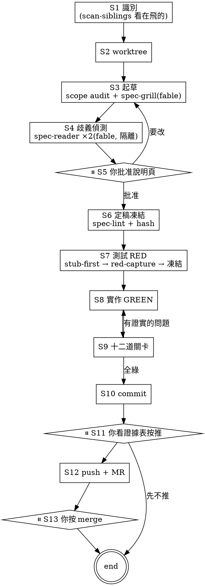

# workflow

端到端 pipeline。**你只出現三次:批准說明頁、看證據表按推、按 merge。沒有一次需要讀程式碼。**

## 五條核心規則

**1. 證據規則。** 每一句「這是對的」都必須跑得出來。AI 提出的問題必須附**可執行的重現**
(會紅的測試 / 存活的變異 / 會命中的指令);跑不出來就自動作廢,不需要任何人裁決。
這條取代了舊版整套 severity rubric 與人工裁決 gate。

**2. 凍結規則。** 規格在人類批准後凍結,規格測試在 RED 後凍結。要改是**明確事件** ——
退回重跑、重新擷取證據、留紀錄。不是偷偷改測試讓它變綠。

**3. 成本規則。** 八道腳本關卡全綠,才啟動四道付費關卡。
絕不花錢請 AI 去審一個腳本本來就會擋掉的東西。

**4. 隔離規則。** 獨立讀者看不到程式碼 —— 這是它存在的**全部理由**。
程式和測試是同一個模型從同一份規格產生的,兩邊很可能一起誤讀;
只有沒被汙染的讀者抓得到。給它看實作等於廢掉這道防線。

**5. 缺席規則。** 「必須附重現」會系統性低估**缺席類**問題(沒接進導航、沒有呼叫點)——
東西不存在時寫不出失敗測試。所以可達性(G8)是獨立的機械關卡,和嚴重度分開排。

## Skip rule

純樣式微調(顏色/間距,無行為變更)可以直接走 `style:` / `chore:` commit,不跑這條線。不確定就跑。

## Project bindings

兩層設定:

**`<repo>/specs/pipeline.yaml`** —— 機器可讀,給關卡腳本用:

```yaml
runner: swift-testing            # red-capture 的輸出解析器
tests:
  globs: ["Packages/*/Tests/**/*.swift", "MindEYTests/**/*.swift"]
  scenario_pattern: '(SC-\d+[a-z]?)'
reachability:
  globs: ["App/**/*.swift"]      # G8 在哪裡找建構點
lint: "swiftlint lint --quiet"
```

**`<repo>/AGENTS.md`** —— 給 AI 讀的散文:`{TEST_COMMAND}`、`{BUILD_COMMAND}`、
`{LAYERING_CONVENTION}`、`{INTEGRATION_BRANCH}`、`{TICKET_PREFIX}`、Security Baseline、專案鐵則。

**專案自備的 skill 只剩兩個**(舊版六個,其餘已被腳本與內建 agent 取代):

| 慣例名 | 用在 | 專案要提供 |
|---|---|---|
| `test-writer` | S7 | 這個 stack 怎麼寫測試、stub 怎麼放 |
| `rd-implementer` | S8 | 這個 stack 怎麼分層實作 |

## Process



## Stages

### S1 識別

1. 問 ticket id(可跳過)、一句功能描述
2. 記錄 `{name}`(kebab-case)與分支名 `feat/[{TICKET}-]{name}`
3. **跑 `scripts/gates/scan-siblings`** —— 列出所有 worktree 在飛的能力。
   同名能力會預警。已落地(在整合分支上)的規格會被濾掉,不算在飛。
4. `specs/{name}/` 已存在 → 問要從哪一階段續跑

### S2 Worktree

新規格一律開新的 linked worktree,除非人明說跳過。

```bash
base="{INTEGRATION_BRANCH}"   # AGENTS.md;沒綁定就停下來問,絕不猜
git show-ref --verify --quiet "refs/heads/${base}" || base="origin/${base}"
git worktree add .worktrees/{name} -b "feat/${branch_name}" "$base" && cd .worktrees/{name} || exit 1
```

續跑時**用精確 ref 比對**解析 worktree,絕不用 unanchored grep ——
有 `-v2` 之類的兄弟分支時會誤中,接著 `cd ""` 靜默留在主目錄。

```bash
wt="$(git worktree list --porcelain \
      | awk -v b="refs/heads/feat/${branch_name}" \
            '/^worktree /{w=substr($0,10)} $0==("branch " b){print w; exit}')"
[ -n "$wt" ] && { cd "$wt" || exit 1; }
```

### S3 起草

1. **Scope audit(必做)** —— 任何「N 個檔案 / N 個呼叫點」的宣稱都必須來自
   **全 codebase grep**,不是 Explore subagent 的抽樣。而且要 grep **呼叫點本身**,
   不是 import(wildcard import 與完全限定呼叫會被漏掉)。
2. 草擬 `specs/{name}/spec.yaml`(見 `references/spec-template.yaml`)
3. **派遣 `spec-grill`**(fable) —— 完備性挑戰 + 洞 + **它自己的解讀表**
   (兼任 S4 的第一個讀者,省一次派遣)
4. **跑 `scan-siblings specs/{name}/spec.yaml`** —— 比對 `impact.files`,
   把會跟其他在飛分支撞的檔案列出來。在寫程式之前知道,比合併時才發現便宜得多。

### S4 歧義偵測

派遣 **2 個 `spec-reader`**(fable,`tools: []`,規格直接貼在 prompt 裡)。
兩種視角:**字面讀者**、**敵意讀者**。

加上 grill 的表共三張,機械比對:

| 比對結果 | 意義 |
|---|---|
| 同 SC-id、同 input、**不同 output** | **分歧** → 變成人類的選擇題 |
| 一邊有這個 input,另一邊沒有 | 覆蓋落差 → 列出來,較弱的訊號 |
| 完全一致 | 兩個獨立讀者理解相同 → 直接寫進規格的 `examples` |

**`examples` 就是契約** —— 它同時是可測性的定義、也是測試本身。
敵意讀者要額外質疑**範例資料本身**:那組資料分得出正確與錯誤的實作嗎?

### S5 ⏸ 你批准說明頁

用 `eli5` skill 產一頁 HTML。內容:

- 白話說明這個功能做什麼
- **分歧選擇題**(來自 S4)
- **「我主張不需要處理」的清單**(六類遺漏裡寫 N/A 的,附理由)
- 受影響的檔案 + 跨分支碰撞警告
- 具體例子用**真實數值**寫 —— 那是人最容易一眼看出「這不是我要的」的形式

你做的事:回答分歧、挑戰 N/A、確認意圖。**不讀規格,不讀程式碼。**

### S6 定稿凍結

1. 把批准內容寫回 `examples`
2. **反向回譯檢查** —— 從規格生成一份說明頁,跟你批准的那份比對。
   防「你批准的和機器建的不是同一件事」
3. `scripts/gates/spec-lint` 必須 PASS
4. hash 凍結 → `specs/{name}/evidence/spec.hash`

### S7 測試 RED

強制 **stub-first**。`compile-fail-as-RED` 不接受 —— 編譯不過不證明任何斷言有效。

**stub 必須回傳/拋出「沒有任何 Scenario 預期的東西」:**

- 回 `[]` 會讓「空清單」那條在實作前就綠 → 空測試
- 靜默成功會讓「不報錯」那條在實作前就綠 → 空測試
- 所以:清單回**哨兵列**、void 拋**哨兵錯誤**

而且**測試要斷言具體錯誤訊息**,不只斷言型別 —— 否則哨兵的 `.validation` 會把
預期 `.validation` 的測試矇混過去。

順序(這個順序是實測教訓):

```
寫測試 → 跑格式化 → 跑測試 → red-capture → 凍結測試檔
         ↑ 先格式化,否則之後修 lint 會讓凍結指紋失效
```

`scripts/gates/red-capture` 需要 `evidence/red-inputs.json` 列出各層的輸出檔與測試檔。

### S8 實作 GREEN

叫 `rd-implementer` 或直接實作。**能動**:產品程式碼、`impl/` 命名空間的測試。
**不能動**:`spec/` 命名空間的測試、`spec.yaml`。兩個都靠 hash 在 S9 擋。

### S9 十二道關卡

見下一節。

### S10 Commit

```
{type}({scope}): {description} [{TICKET} if any]

{body:設計決定、驗證摘要、已知取捨}

Spec: specs/{name}/spec.yaml
Scenarios: SC-001, SC-002, ...
AI-assisted: claude
```

### S11 ⏸ 你看證據表按推

`scripts/gates/dashboard specs/{name}/spec.yaml` 產出 HTML。

**可達性排在最前面,和嚴重度分開。** 另外顯示**審查活動量**(提出 N → 作廢 M → 證實 K)——
一張只有綠勾的表會訓練你變成橡皮圖章;活動量才分得出「乾淨」和「沒認真查」。

### S12 Push + MR

```bash
git push origin "feat/${branch_name}"    # 絕不直推整合分支
gh pr create --base {INTEGRATION_BRANCH} ...   # 或 glab mr create
```

### S13 ⏸ 你按 merge

**orchestrator 一律不代按 merge。**

## 十二道關卡

```
腳本判定 · 幾乎不花錢 · 全綠才啟動下半
  G0  spec-lint        schema + 完備性六類 + 可測性
  G1  freeze-check     規格指紋 + **可解析性**(凍結一個載不進來的檔毫無意義)
  G2  freeze-check     規格測試指紋
  G3  lint             **只看變更的檔案** —— 真實 repo 都有歷史債,
                       要求整包乾淨等於這關從第一天就失效
  G4  測試 + 專案自有的靜態檢查
  G5  red-capture      六類 + 三方對帳
  G6  traceability     Scenario ↔ 測試雙向
  G7  examples 覆蓋
  G8  可達性           新增的型別有沒有人建構它
────────────────────────────────────────────
付費判定
  G9   變異測試        有工具才跑;沒有就對關鍵斷言做定向變異
  G10  spec-oracle     fable,隔離,只憑規格寫驗收測試
  G11  code-adversary  fable,每條主張附可執行的重現
  G12  UI 截圖         有畫面變更才跑,導航到目標畫面截圖
```

### G5 的六類

| failure_class | 意義 | 處置 |
|---|---|---|
| `assertion` | 斷言評估過、值不對 | ✅ 最強證據 |
| `stub_sentinel` | 哨兵錯誤逸出,斷言沒跑到 | ✅ 可接受,較弱 |
| `error` | 其他錯誤逸出 | ❌ 擋 |
| `compile` | 編譯不過 | ❌ 擋 |
| `hang` | 測試沒跑完 | ❌ 擋,**最惡劣** |
| `passed` | 實作前就綠 | ❌ 擋,除非規格裡有 `red_exempt_reason` |

**`hang` 為什麼最惡劣:** 它沒有訊息可以分類,而且會讓**它後面的測試靜默不執行**。
所以對帳必須比對「原始碼宣告數 / runner 回報數 / 實際啟動數」三者 ——
只解析結果會把「有一條沒跑」誤報成全部通過。

錨點要用 **started 行**,不是最終結果行 —— 參數化測試不發單一最終結果行。

### G10 失敗了算誰的

人不讀程式碼,所以裁判必須是機械的。**規格的 `examples` 當裁判:**

| oracle 的斷言 | 處置 |
|---|---|
| 與某條 example **矛盾** | oracle 錯,自動作廢 |
| 與某條 example **一致**但實作沒過 | 實作有 bug → **擋** |
| 落在所有 example **之外**且紅了 | **規格缺口** → 記錄 + 在證據表具名,**不擋** |

第三列是設計**明確接受殘留風險**的地方:擋的話 oracle 可以無中生有任意需求,
迴圈永遠不收斂。代價是真有可能出貨一個 bug,所以它必須在你按推之前具名出現。

### G11 的重現形式

| finding 類別 | 重現 | 判定 |
|---|---|---|
| 程式碼 / 行為正確性 | 一條會紅的測試 | 跑得紅 → 真的;跑得綠 → 作廢 |
| 測試正確性(假綠) | 一個存活的變異 | 實際注入該變異跑一次 |
| 資安 | 一條會命中的指令 | 實際跑 |

成立的 finding,**那條重現測試直接進 `regression/` 命名空間** —— 白賺一條回歸測試。

## 迴圈與收斂

- 修完之後**重跑 G0–G8**(腳本,幾乎免費)+ 該條重現測試
- **不重派 G10/G11**,除非 fix diff 跨超過一個檔或超過行數門檻
- G11 最多重派 **1 次**(它是最貴的一次派遣)
- 同一條 finding **修過又出現** → 立即停
- 同一條 finding **修 2 次還沒解** → 停,標 `parked`

停下來不是叫你看程式碼,是在證據表上列一行:「SC-003 有一條已證實的失敗,2 次修復未果」。
你的決定是:照樣出貨 / 分支停在這 / 回頭改規格。**這是決策,不是 code review。**

## 同時進行多個需求

**pipeline,不是 parallel。** 機器階段 30–60 分鐘、人類階段約 6 分鐘,比例 7:1 ——
所以要讓「你審 A 的說明頁時 B 正在跑建置」,而不是 N 個功能各自來打擾你。
實務建議同時 2–3 個(理論飽和點更高,但人的 context switch 成本很real)。

一個功能一個 session。**共享狀態放檔案系統,不需要塔台:**

- `scan-siblings` —— 跨 worktree 掃規格,得到能力清單與碰撞警告
- `runs` —— 跨 worktree 狀態列表,一眼看完誰卡在哪、誰在等你
- 兄弟分支 merge 進整合分支後,其他 worktree 的基準線失效 →
  rebase 後**重跑 G0–G8**(呼叫點清單與 lint 基準都要重算)

## Common Mistakes

| 錯誤 | 正解 |
|---|---|
| 規格從來沒被機器讀過 | `spec-lint` 必須在凍結**之前**跑;`freeze-check` 也重驗可解析性 |
| stub 回傳測試預期的值 | 哨兵值必須是**沒有任何 Scenario 預期**的東西,否則測試實作前就綠 |
| 測試只斷言錯誤型別不斷言訊息 | 哨兵的 `.validation` 會矇混過去 |
| 擷取 RED 之後才跑格式化 | 凍結指紋會被純排版變更誤觸;先格式化再擷取 |
| lint gate 要求整個 repo 乾淨 | 只看變更的檔案;既有債用基準線比對 |
| 對帳錨在最終結果行 | 參數化測試不發單一最終結果行;錨在 `started` |
| 給獨立讀者看程式碼 | 那是它存在的全部理由,給了等於廢掉 |
| 缺席類問題只記 WARNING | 那類寫不出失敗測試;靠 G8 可達性擋 |
| 外包正則給 `git grep -E` | POSIX ERE 不支援 `\b` / `\s`,會靜默匹配不到 |
| 機械改檔不 assert 錨點命中 | 格式化過的檔案會讓字串比對靜默失敗 |
| 續跑時用 unanchored grep 找 worktree | 只用精確 ref 比對 |
| 抽樣式 scope audit | 全 codebase grep,而且 grep 呼叫點不是 import |
| 代按 merge | 一律人工 |

## Templates

- `references/spec-template.yaml` —— 規格的結構化格式
- `references/dispatch-prompts.md` —— 各 agent 的派遣 prompt 骨架

## Related

- `scripts/gates/*` —— 十二道關卡的實作
- `agents/*` —— spec-grill / spec-reader / spec-oracle / code-adversary
- `eli5` skill —— S5 的說明頁
- `test-writer` / `rd-implementer` —— **專案自備**的兩個 skill
- `PIPELINE.md` —— 對外的簡介(不是鏡像,只是入口)
